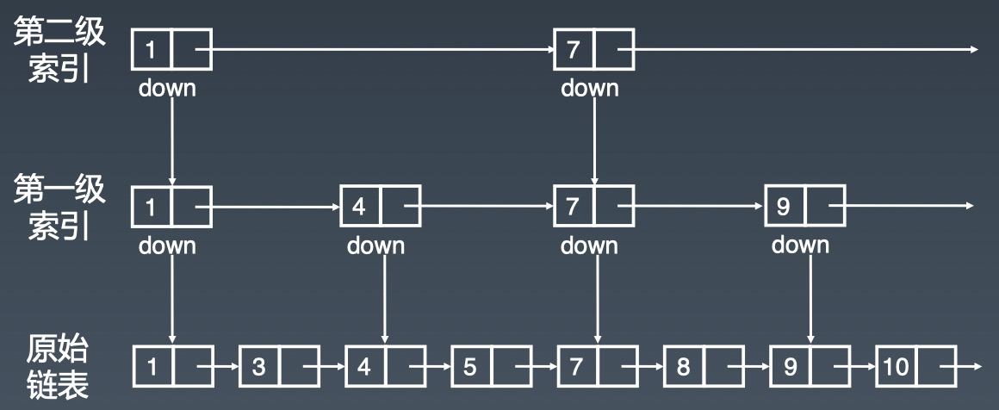

# 数组、链表、跳表、栈、队列

## 总结
1. 一维数据结构加速通常需要升为二维
2. 好文：[数据结构与算法之美笔记 : 平衡二叉树、跳表、B - Tree、 B + Tree 、 B * Tree](https://blog.csdn.net/zhanglong_4444/article/details/90603453)

## 数组
暂无

## 链表

head -> node -> tail

快慢指针的特性：每轮移动之后两者的距离会加一，如果一个链表存在环，那么快慢指针必然会相遇。

如果存在环，如何判断环的长度呢？方法是，快慢指针相遇后继续移动，直到第二次相遇。两次相遇间的移动次数即为环的长度。

## 跳表
1. 链表元素是有序的
2. 出现的很晚（1990年）
3. 对标平衡二叉搜索树「AVL Tree」和二分查找
4. 原理简单、容易实现、方便扩展、效率更高
5. 新的项目均使用跳表替代平衡二叉搜索树
6. 空间复杂度是O(n)，但是实际复杂度大于原链表

## 栈和队列

- stack：先进后出 LIFO last in first out
- queue：先进先出 FIFO first in first out
- deque：同时有以上两种特性

## Priority Queue
1. 底层数据结构 Heap、BST「binary search tree」

### API

- peek()

- push()
- pop()

- offer()
- poll()

## 复杂度

| 数组 | 时间复杂度 | 空间复杂度 |
|---|---|---|
| 插入删除 | O(n) | O(n) |
| 随机访问 | O(1) | O(n) |

| 链表 | 时间复杂度 | 空间复杂度 |
|---|---|---|
| 插入删除 | O(1) | O(n) |
| 随机访问 | O(n) | O(n) |

| 跳表 | 时间复杂度 | 空间复杂度 |
|---|---|---|
| 插入删除 | O(log n) | O(n) |
| 搜索 | O(log n) | O(n) |

| 栈和队列 | 时间复杂度 | 空间复杂度 |
|---|---|---|
| 插入删除 | O(1) | O(n) |
| 搜索 | O(n) | O(n) |

| 优先队列 | 时间复杂度 | 空间复杂度 |
|---|---|---|
| 插入 | O(log n) | O(n) |
| 取出 | O(log n) | O(n) |

## 心得
这周学习的知识内容还好，只是每节的LeetCode题目比较多，在做题的同时，发现有同类型的题目，故一并进行了练习，导致花的时间比较多，具体可参见本文末尾。

发现问题及后续准备如下：
1. 「困难」难度的题目，大多解析都需要研究半小时以上才勉强理解，需要多加练习。
2. 除了每节提到的题目外，又额外做了一些题目，导致课后作业都未完全完成，之后需要尽量专注于每节作业，有余力再看其他题目。
3. 每道题目均按照五毒法练习，保证真正熟练。

## LeetCode

### 数组
| 题目 | 项目链接 | leetcode |
|---|---|---|
| 26. 删除排序数组中的重复项 | [RemoveDuplicatesFromSortedArray](leetcode1/RemoveDuplicatesFromSortedArray.java) | [remove-duplicates-from-sorted-array](https://leetcode-cn.com/problems/remove-duplicates-from-sorted-array/) |
| 1. 两数之和 | [TwoSum](leetcode1/TwoSum.java) | [two-sum](https://leetcode-cn.com/problems/two-sum/) |
| 15. 三数之和 | [ThreeSum](leetcode1/ThreeSum.java) | [3sum](https://leetcode-cn.com/problems/3sum/) |
| 283. 移动零 | [MoveZeroes](leetcode1/MoveZeroes.java) | [move-zeroes](https://leetcode-cn.com/problems/move-zeroes/) |
| 11. 盛最多水的容器 | [ContainerWithMostWater](leetcode1/ContainerWithMostWater.java) | [container-with-most-water](https://leetcode-cn.com/problems/container-with-most-water/) |
| 70. 爬楼梯 | [ClimbingStairs](leetcode1/ClimbingStairs.java) | [climbing-stairs](https://leetcode-cn.com/problems/climbing-stairs/) |
| 66. 加一 | [PlusOne](leetcode1/PlusOne.java) | [plus-one](https://leetcode-cn.com/problems/plus-one/) |
| 189. 轮转数组 | [RotateArray](leetcode1/RotateArray.java) | [rotate-array](https://leetcode-cn.com/problems/rotate-array/) |
| 88. 合并两个有序数组 | [MergeSortedArray](leetcode1/MergeSortedArray.java) | [merge-sorted-array](https://leetcode-cn.com/problems/merge-sorted-array/) |
|---|||
| 16. 最接近的三数之和 | [ThreeSumClosest](leetcode1/ThreeSumClosest.java) | [3sum-closest](https://leetcode-cn.com/problems/3sum-closest/) |
| 18. 四数之和 | [FourSum](leetcode1/FourSum.java) | [4sum](https://leetcode-cn.com/problems/4sum/) |

### 链表
| 题目 | 项目链接 | leetcode |
|---|---|---|
| 206. 反转链表 | [ReverseLinkedList](leetcode1/ReverseLinkedList.java) | [reverse-linked-list](https://leetcode-cn.com/problems/reverse-linked-list/) |
| 21. 合并两个有序链表 | [MergeTwoSortedLists](leetcode1/MergeTwoSortedLists.java) | [merge-two-sorted-lists](https://leetcode-cn.com/problems/merge-two-sorted-lists/) |
| 141. 环形链表 | [LinkedListCycle](leetcode1/LinkedListCycle.java) | [linked-list-cycle](https://leetcode-cn.com/problems/linked-list-cycle/) |
| 142. 环形链表 II | [LinkedListCycleIi](leetcode1/LinkedListCycleIi.java) | [linked-list-cycle-ii](https://leetcode-cn.com/problems/linked-list-cycle-ii/) |
| 24. 两两交换链表中的节点 | [SwapNodesInPairs](leetcode1/SwapNodesInPairs.java) | [swap-nodes-in-pairs](https://leetcode-cn.com/problems/swap-nodes-in-pairs/) |
| 25. K个一组翻转链表 | [ReverseNodesInKGroup](leetcode1/ReverseNodesInKGroup.java) | [reverse-nodes-in-k-group](https://leetcode-cn.com/problems/reverse-nodes-in-k-group/) |

### 栈和队列
| 题目 | 项目链接 | leetcode |
|---|---|---|
| 20. 有效的括号 | [ValidParentheses](leetcode1/ValidParentheses.java) | [valid-parentheses](https://leetcode-cn.com/problems/valid-parentheses/) |
| 678. 有效的括号字符串 | [ValidParenthesisString](leetcode1/ValidParenthesisString.java) | [valid-parenthesis-string](https://leetcode-cn.com/problems/valid-parenthesis-string/) |
| 155. 最小栈 | [MinStack](leetcode1/MinStack1.java) | [min-stack](https://leetcode-cn.com/problems/min-stack/) |
| 84. 柱状图中最大的矩形 | [LargestRectangleInHistogram](leetcode1/LargestRectangleInHistogram.java) | [largest-rectangle-in-histogram](https://leetcode-cn.com/problems/largest-rectangle-in-histogram/) |
| 239. 滑动窗口最大值 | [SlidingWindowMaximum](../section-2/leetcode2/SlidingWindowMaximum.java) | [sliding-window-maximum](https://leetcode-cn.com/problems/sliding-window-maximum/) |
| 42. 接雨水 | [TrappingRainWater](leetcode1/TrappingRainWater.java) | [trapping-rain-water](https://leetcode-cn.com/problems/trapping-rain-water/) |

## 参考资料
[LRU缓存算法](https://www.jianshu.com/p/b1ab4a170c3c)
[Redis 跳表实现](https://redisbook.readthedocs.io/en/latest/internal-datastruct/skiplist.html)
