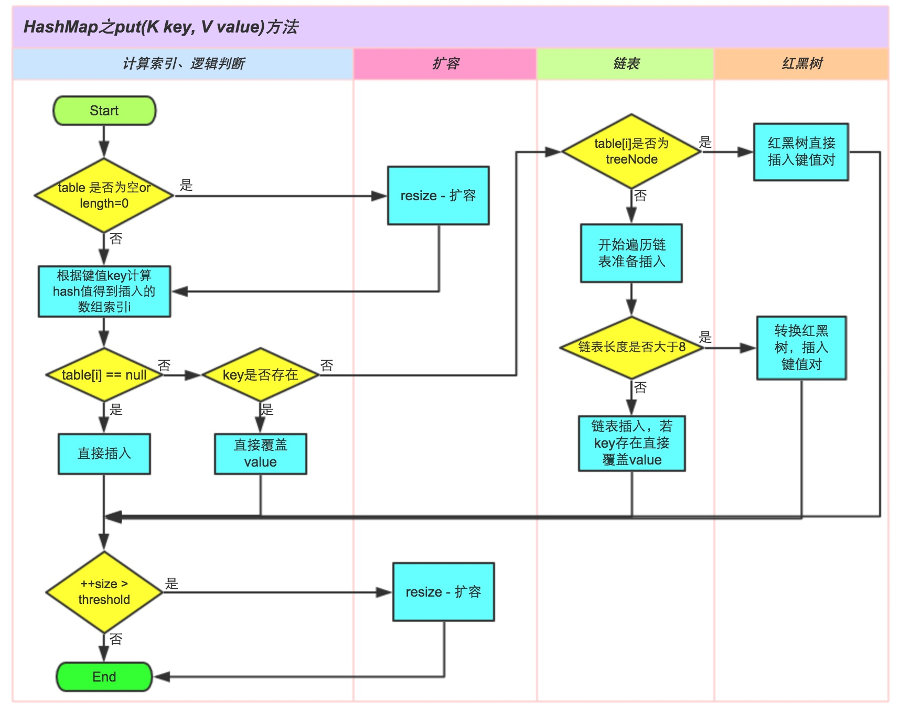

# 哈希表Hash、映射Map、集合Set、二叉树、二叉搜索树、堆、二叉堆

## 心得
1. 本周的题目偏向于训练基础能力，为 section 3、section 4打基础使用，需要反复练习并形成肌肉记忆。
2. JDK中Map和List接口的基础实现类，需要熟悉源码，作为基础，需要熟记并可进行横向对比。

## Hash

### HashMap
注：本节图片均为引用

#### 关键参数
- Node[] table;              // 哈希桶数组，默认初始值16
- int threshold;             // 所能容纳的key-value对极限 
- float loadFactor = 0.75    // 负载因子，默认0.75

- int TREEIFY_THRESHOLD = 8;    // 链表元素个数超过该值转为红黑树
- int UNTREEIFY_THRESHOLD = 8;  // 红黑树元素个数低于该值转为链表
- int MIN_TREEIFY_CAPACITY = 64;// Map元素个数低于该值使用resize代替转红黑树

#### 关键方法
- resize()  // 将Map容量扩充为原来的两倍
- remove()  // 链表中移除node节点，或从红黑树中移除node
- put()     // 见下图：

文章推荐：
[Java 8系列之重新认识HashMap](https://zhuanlan.zhihu.com/p/21673805)

## 数、二叉树、二叉搜索树
二叉搜索树：是指一棵空树或者具有下列性质的二叉树：
1. 左子树上所有结点的值均小于它的根结点的值；
2. 右子树上所有结点的值均大于它的根结点的值；
3. 以此类推：左、右子树也分别为二叉查找树。 （这就是 重复性！）
- 中序遍历：升序排列
- 树的面试题解法一般都是递归

### 总结

1. Linked List 是特殊化的 Tree，Tree 是特殊化的 Graph
2. Graph有环，Tree无环
3. 遍历，前序、中序、后序：根节点的位置

## 堆、二叉堆

### 堆

1. 在一组数中迅速找到最大值或最小值的数据结构
2. 大顶堆或小顶堆
3. 二叉堆是常见的堆，但是效率较低
4. 找到最大值或最小值的时间复杂度必须为O(1)

### 二叉堆
1. 通过完全二叉树「满二叉树」实现「不是二叉搜索树」
2. 树中任意节点的值总是 >= 其子节点的值

#### 实现
1. 实现方式：数组
2. i的左子节点：(2 * i + 1)
3. i的右子节点：(2 * i + 2)
3. i的父节点：(i - 1) / 2

#### 操作
1. 插入：插入尾部，依次向上调整整个堆结构
2. 删除堆顶：将堆尾元素替换到堆顶，依次向下调整整个堆结构

### 复杂度

| 二叉堆 | 时间复杂度 | 空间复杂度 |
|---|---|---|
| 插入，删除顶   | O(logN)   | O(n) |
| 最大值、最小值  | O(1)      | O(n) |

## LeetCode

### 哈希表Hash、映射Map、集合Set
| 题目 | 项目链接 | leetcode |
|---|---|---|
| 242. 有效的字母异位词 | [ValidAnagram](leetcode2/ValidAnagram.java) | [valid-anagram](https://leetcode-cn.com/problems/valid-anagram/) |
| 49. 字母异位词分组 | [GroupAnagrams](leetcode2/GroupAnagrams.java) | [group-anagrams](https://leetcode-cn.com/problems/group-anagrams/) |

### 树、二叉树、二叉搜索树
| 题目 | 项目链接 | leetcode |
|---|---|---|
| 144. 二叉树的前序遍历 | [BinaryTreePreorderTraversal](leetcode2/BinaryTreePreorderTraversal.java) | [binary-tree-preorder-traversal](https://leetcode-cn.com/problems/binary-tree-preorder-traversal/) |
| 94. 二叉树的中序遍历 | [BinaryTreeInorderTraversal](leetcode2/BinaryTreeInorderTraversal.java) | [binary-tree-inorder-traversal](https://leetcode-cn.com/problems/binary-tree-inorder-traversal/) |
| 145. 二叉树的后序遍历 | [BinaryTreePostorderTraversal](leetcode2/BinaryTreePostorderTraversal.java) | [binary-tree-postorder-traversal](https://leetcode-cn.com/problems/binary-tree-postorder-traversal/) |
| 589. N叉树的前序遍历 | [NAryTreePreorderTraversal](leetcode2/NAryTreePreorderTraversal.java) | [n-ary-tree-preorder-traversal](https://leetcode-cn.com/problems/n-ary-tree-preorder-traversal/) |
| 590. N叉树的后序遍历 | [NAryTreePostorderTraversal](leetcode2/NAryTreePostorderTraversal.java) | [n-ary-tree-postorder-traversal](https://leetcode-cn.com/problems/n-ary-tree-postorder-traversal/) |
| 429. N叉树的层序遍历 | [NAryTreeLevelOrderTraversal](leetcode2/NAryTreeLevelOrderTraversal.java) | [n-ary-tree-level-order-traversal](https://leetcode-cn.com/problems/n-ary-tree-level-order-traversal/) |

### 堆和二叉堆
| 题目 | 项目链接 | leetcode |
|---|---|---|
| 239. 滑动窗口最大值 | [SlidingWindowMaximum](leetcode2/SlidingWindowMaximum.java) | [sliding-window-maximum](https://leetcode-cn.com/problems/sliding-window-maximum/) |
| 剑指 Offer 40. 最小的k个数 | [ZuiXiaoDeKgeShuLcof](leetcode2/ZuiXiaoDeKgeShuLcof.java) | [zui-xiao-de-kge-shu-lcof](https://leetcode-cn.com/problems/zui-xiao-de-kge-shu-lcof/) |
| 剑指 Offer 49. 丑数 | [ChouShuLcof](leetcode2/ChouShuLcof.java) | [chou-shu-lcof](https://leetcode-cn.com/problems/chou-shu-lcof/) |
| 347. 前 K 个高频元素 | [TopKFrequentElements](leetcode2/TopKFrequentElements.java) | [top-k-frequent-elements](https://leetcode-cn.com/problems/top-k-frequent-elements/) |
