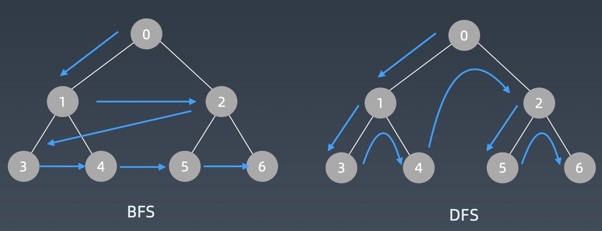

# DFS、BFS、贪心算法、二分查找

## 深度优先搜索「DFS」、广度优先搜索「BFS」

- 深度优先：depth first search
- 广度优先：breadth first search

### 搜索、遍历要求

- 每个节点都要访问一次
- 每个节点仅仅要访问一次
- 对于节点的访问顺序不限
- DFS、BFS循环写法区别仅仅是Stack、Queue

### DFS 代码模板

递归法

```java
public class DfsTest {

    private void dfs(Node node, Set<Node> visited) {
        if (visited.contains(node)) {
            return;
        }
        visited.add(node);
        process(node.val);
        for (Node child : node.children) {
            if (!visited.contains(child)) {
                dfs(child, visited);
            }
        }
    }
}
```

循环法

```java
public class DfsTest {

    private void dfsMain(Node root) {
        Deque<Node> stack = new ArrayDeque<>();
        stack.push(root);
        Set<Node> visited = new HashSet<>();
        while (!stack.isEmpty()) {
            Node node = stack.pop();
            if (visited.contains(node)) {
                return;
            }
            visited.add(node);
            process(node.val);
            for (Node child : node.children) {
                stack.push(child);
            }
        }
    }
}
```

### BFS 代码模板

循环法

```java
public class BfsTest {

    private void bfsMain(Node root) {
        Deque<Node> queue = new ArrayDeque<>();
        queue.offer(root);
        Set<Node> visited = new HashSet<>();
        while (!queue.isEmpty()) {
            Node node = queue.poll();
            if (visited.contains(node)) {
                return;
            }
            visited.add(node);
            process(node.val);
            for (Node child : node.children) {
                queue.offer(child);
            }
        }
    }
}
```

### 遍历顺序



## 贪心算法 Greedy

贪心算法是一种在每一步选择中都采取在当前状态下最好或最优（即最有利）的选择，从而希望导致结果是全局最好或最优的算法。

一旦一个问题可以通过贪心法来解决，那么贪心法一般是解决这个问题的最好办法。由于贪心法的高效性以及其所求得的答案比较接近最优结果，贪心法也可以用作辅助算法或者直接解决一些要求结果不特别精确的问题。

### 贪心算法与动态规划的不同

- 贪心：对每个子问题的解决方案都做出选择，不能回退。
- 动态规划：会保存以前的运算结果，并根据以前的结果对当前进行选择，有回退功能。

### 比较

- 贪心：当下局部最优判断
- 回溯：能够回退
- 动态规划：最优判断 + 回退

## 二分查找

### 二分查找的前提

1. 目标函数单调性（单调递增或者递减）
2. 存在上下界（bounded）
3. 能够通过索引访问（index accessible)

### 二分查找模板

```java
public class Test {

    public int binarySearch(int[] array, int target) {
        int left = 0;
        int right = array.length - 1;
        int mid;
        while (left <= right) {
            mid = (right - left) / 2 + left;

            if (array[mid] == target) {
                return mid;
            } else if (array[mid] > target) {
                right = mid - 1;
            } else {
                left = mid + 1;
            }
        }

        return -1;
    }
}
```

### 二分查找技巧

取左中值，left要跨中值

```
int mid = left + (right - left) / 2;
if (arr[mid] < target) {
    left = mid + 1;
} else {
    right = mid;
}
```

取右中值，right要跨中值

```
int mid = left + (right - left + 1) / 2;
if (arr[mid] <= target) {
    left = mid;
} else {
    right = mid - 1;
}
```

## LeetCode

### DFS & BFS

| 题目 | 项目链接 | leetcode | 心得                  |
|---|---|---|---------------------|
| 102. 二叉树的层序遍历 | [BinaryTreeLevelOrderTraversal](leetcode4/BinaryTreeLevelOrderTraversal.java) | [binary-tree-level-order-traversal](https://leetcode-cn.com/problems/binary-tree-level-order-traversal/) | DFS、BFS             |
| 22. 括号生成 | [GenerateParentheses](../section-7/leetcode7/GenerateParentheses.java) | [generate-parentheses](https://leetcode-cn.com/problems/generate-parentheses/) | 可用递归、DFS、BFS        |
| 515. 在每个树行中找最大值 | [FindLargestValueInEachTreeRow](leetcode4/FindLargestValueInEachTreeRow.java) | [find-largest-value-in-each-tree-row/](https://leetcode-cn.com/problems/find-largest-value-in-each-tree-row/) | DFS、BFS             |
| 433. 最小基因变化 | [MinimumGeneticMutation](leetcode4/MinimumGeneticMutation.java) | [minimum-genetic-mutation](https://leetcode-cn.com/problems/minimum-genetic-mutation/) |                     |
| 200. 岛屿数量 | [NumberOfIslands](leetcode4/NumberOfIslands.java) | [number-of-islands](https://leetcode-cn.com/problems/number-of-islands/) | DFS、BFS             |
| 127. 单词接龙 | [WordLadder](../section-7/leetcode7/WordLadder.java) | [word-ladder](https://leetcode-cn.com/problems/word-ladder) | BFS，不可用DFS，双向BFS待补充 |
| 529. 扫雷游戏 | [Minesweeper](leetcode4/Minesweeper.java) | [minesweeper](https://leetcode-cn.com/problems/minesweeper/) | DFS                 |

### 贪心算法

| 题目 | 项目链接                                                                                   | leetcode | 心得   |
|---|----------------------------------------------------------------------------------------|---|------|
| 322. 零钱兑换 | [CoinChange](leetcode4/CoinChange.java)                                                | [coin-change](https://leetcode-cn.com/problems/coin-change/) | DFS  |
| 518. 零钱兑换 II | [CoinChange2](leetcode4/CoinChange2.java)                                               | [coin-change-2](https://leetcode-cn.com/problems/coin-change-2/) | DP   |
| 860. 柠檬水找零 | [LemonadeChange](leetcode4/LemonadeChange.java)                                        | [lemonade-change](https://leetcode-cn.com/problems/lemonade-change/) | DP   |
| 455. 分发饼干 | [AssignCookies](leetcode4/AssignCookies.java)                                          | [assign-cookies](https://leetcode-cn.com/problems/assign-cookies/) | 贪心算法 |
| 122. 买卖股票的最佳时机 II | [BestTimeToBuyAndSellStockIi](../section-6/leetcode6/BestTimeToBuyAndSellStockIi.java) | [best-time-to-buy-and-sell-stock-ii](https://leetcode-cn.com/problems/best-time-to-buy-and-sell-stock-ii/) | 贪心   |
| 874. 模拟行走机器人 | [WalkingRobotSimulation](leetcode4/WalkingRobotSimulation.java)                        | [walking-robot-simulation](https://leetcode-cn.com/problems/walking-robot-simulation/) | 贪心   |
| 55. 跳跃游戏 | [JumpGame](leetcode4/JumpGame.java)                                                    | [jump-game](https://leetcode-cn.com/problems/jump-game/) | 贪心   |
| 45. 跳跃游戏 II | [JumpGameIi](leetcode4/JumpGameIi.java)                                                | [jump-game-ii](https://leetcode-cn.com/problems/jump-game-ii/) | 贪心   |

### 二分查找

| 题目 | 项目链接 | leetcode | 心得 |
|---|---|---|---|
| 69. x 的平方根 | [Sqrtx](leetcode4/Sqrtx.java) | [sqrtx](https://leetcode-cn.com/problems/sqrtx/) | 二分查找 |
| 367. 有效的完全平方数 | [ValidPerfectSquare](leetcode4/ValidPerfectSquare.java) | [valid-perfect-square](https://leetcode-cn.com/problems/valid-perfect-square/) | 二分查找 |
| 153. 寻找旋转排序数组中的最小值 | [FindMinimumInRotatedSortedArray](leetcode4/FindMinimumInRotatedSortedArray.java) | [find-minimum-in-rotated-sorted-array](https://leetcode-cn.com/problems/find-minimum-in-rotated-sorted-array/) | 二分查找 |
| 33. 搜索旋转排序数组| [SearchInRotatedSortedArray](leetcode4/SearchInRotatedSortedArray.java) | [search-in-rotated-sorted-array](https://leetcode-cn.com/problems/search-in-rotated-sorted-array/) | 二分查找 |
| 35. 搜索插入位置 | [SearchInsertPosition](leetcode4/SearchInsertPosition.java) | [search-insert-position](https://leetcode-cn.com/problems/search-insert-position/) | 二分查找 |
| 74. 搜索二维矩阵 | [SearchA2dMatrix](leetcode4/SearchA2dMatrix.java) | [search-a-2d-matrix](https://leetcode-cn.com/problems/search-a-2d-matrix/) | 二分查找 |
| 使用二分查找，寻找一个半有序数组 [4, 5, 6, 7, 0, 1, 2] 中间无序的地方 |  |  | 参考「153. 寻找旋转排序数组中的最小值」求得最小值，其与前值即为无序处 |
