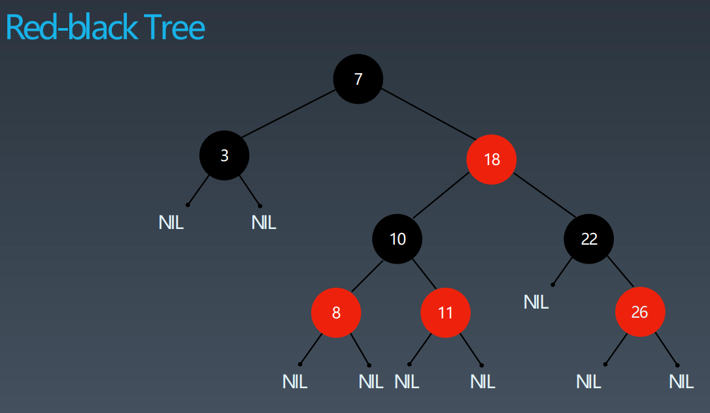

# 字典树、并查集、剪枝、回溯、双向BFS、AVL树、红黑树

## 心得

### 回溯算法

- 回溯一般与DFS、递归配套使用
- 八皇后，使用Deque-stack数据结构，存储每一行的计算结果，从而方便撤销上一步计算结果
- 解数独，数组中计算并选择可以填充元素的格子「cell」，遍历1-9，无效时可撤销之前计算结果
- 八皇后只需要一维数组，解数独需要二维数组，所以造成了算法实现的差异

## 字典树、并查集

todo

## 剪枝、回溯、双向BFS

### 初级搜索

1. 朴素搜索
2. 优化方式：不重复（fibonacci）、剪枝（生成括号问题）
3. 搜索方向：

- DFS: depth first search 深度优先搜索
- BFS: breadth first search 广度优先搜索

## AVL树与 红黑树

### 二叉搜索树 Binary Search Tree

二叉搜索树，也称二叉搜索树、有序二叉树（Ordered Binary Tree）、排序二叉树（Sorted Binary Tree），是指一棵空树或者具有下列性质的二叉树： 

中序遍历：升序排列

1. 左子树上所有结点的值均小于它的根结点的值；
2. 右子树上所有结点的值均大于它的根结点的值；
3. 以此类推：左、右子树也分别为二叉查找树。 （这就是 重复性！）

### AVL 树
- 平衡二叉搜索树
- Math.abs(左子树高度 - 右子树高度) <= 1
- 通过旋转操作来进行平衡（四种）

不足：

- 结点需要存储额外信息「深度信息」、且调整次数频繁

### 红黑树

红黑树是一种近似平衡的二叉搜索树（Binary Search Tree），它能够确保任何一个结点的左右子树的高度差小于两倍。具体来说，红黑树是满足如下条件的二叉搜索树：

- 每个结点要么是红色，要么是黑色
- 根结点是黑色
- 每个叶结点（NIL结点，空结点）是黑色的。
- 不能有相邻接的两个红色结点
- 从任一结点到其每个叶子的所有路径都包含相同数目的黑色结点

#### 重点

从根到叶子的最长的可能路径不多于最短的可能路径的两倍长。

### AVL树 VS 红黑树

- 查询性能：AVL树查询性能更好「更平衡」
- 变更性能：红黑树插入、删除性能更好「更少的重平衡操作」
- 额外存储：AVL树需要1个integer「节点深度」，红黑树需要1个bit「颜色」
- 用途：红黑树用于语言的类库「Map」，AVL用于数据库「读多写少」

## LeetCode

### 字典树 Trie，还是使用了剪枝、回溯解法

| 题目                      | 项目链接 | leetcode | 心得 |
|-------------------------|---|---|---|
| 208. 实现 Trie (字典树「前缀树」) | [ImplementTriePrefixTree](leetcode7/ImplementTriePrefixTree.java) | [implement-trie-prefix-tree](https://leetcode-cn.com/problems/implement-trie-prefix-tree/) | 标准实现 |
| 79. 单词搜索                | [WordSearch](leetcode7/WordSearch.java) | [word-search](https://leetcode-cn.com/problems/word-search/) | DFS + 回溯 |
| 212. 单词搜索 II            | [WordSearchIi](leetcode7/WordSearchIi.java) | [word-search-ii](https://leetcode-cn.com/problems/word-search-ii/) | 字典树 |
| 130. 被围绕的区域             | [SurroundedRegions](leetcode7/SurroundedRegions.java) | [surrounded-regions](https://leetcode-cn.com/problems/surrounded-regions/) | DFS |
| 547. 省份数量*              | [NumberOfProvinces](leetcode7/NumberOfProvinces.java) | [number-of-provinces](https://leetcode-cn.com/problems/number-of-provinces/) | DFS |

### 剪枝、回溯

| 题目 | 项目链接 | leetcode | 心得 |
|---|---|---|---|
| 70. 爬楼梯 | [ClimbingStairs](leetcode7/ClimbingStairs.java) | [climbing-stairs](https://leetcode-cn.com/problems/climbing-stairs/) | DP |
| 22. 括号生成 | [GenerateParentheses](leetcode7/GenerateParentheses.java) | [generate-parentheses](https://leetcode-cn.com/problems/generate-parentheses/) | DFS、BFS「递归、非递归」、回溯 |
| 51. N皇后 | [NQueens](leetcode7/NQueens.java) | [n-queens](https://leetcode-cn.com/problems/n-queens/) | 回溯，Stack存储中间结果 |
| 36. 有效的数独 | [ValidSudoku](leetcode7/ValidSudoku.java) | [valid-sudoku](https://leetcode-cn.com/problems/valid-sudoku/) | 主要看代码实现是否优雅 |
| 37. 解数独 | [SudokuSolver](leetcode7/SudokuSolver.java) | [sudoku-solver](https://leetcode-cn.com/problems/sudoku-solver/) | 回溯，入参二维数组存储中间结果 |
| 433. 最小基因变化 | [MinimumGeneticMutation](leetcode7/MinimumGeneticMutation.java) | [minimum-genetic-mutation](https://leetcode-cn.com/problems/minimum-genetic-mutation/) | BFS，新增双向BFS，不过难度确实较大 |
| 127. 单词接龙 | [WordLadder](leetcode7/WordLadder.java) | [word-ladder](https://leetcode-cn.com/problems/word-ladder/) | BFS，双向BFS待补充 |
| 1091. 二进制矩阵中的最短路径 | [ShortestPathInBinaryMatrix](leetcode7/ShortestPathInBinaryMatrix.java) | [shortest-path-in-binary-matrix](https://leetcode-cn.com/problems/shortest-path-in-binary-matrix/) | BFS |
| 773. 滑动谜题 | [SlidingPuzzle](leetcode7/SlidingPuzzle.java) | [sliding-puzzle](https://leetcode-cn.com/problems/sliding-puzzle/) | BFS |
