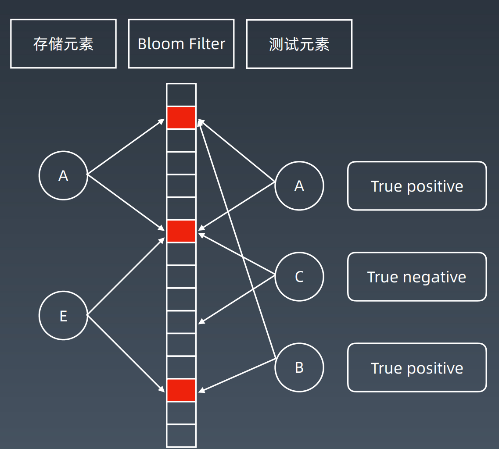
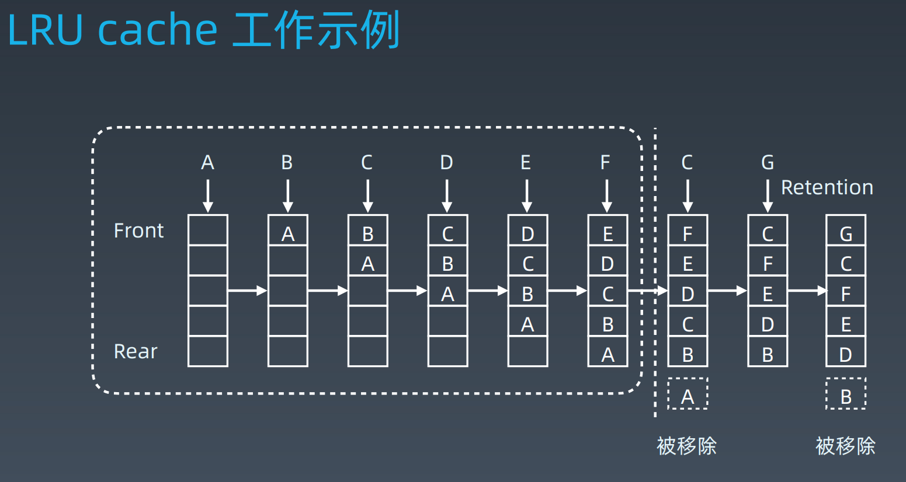

# 位运算、布隆过滤器、LRU缓存、排序算法

## 心得

### i++

- 在一个语句中，如果 i 被用到多次的话，i++ 会从左到右进行计算，并取其计算结果使用。
- 在一个语句中，多种变量「i, j, k」分别执行 x++ 操作时，每种变量互不影响；单种变量自身互相影响，看前一条
- 就算是在表达式中，也是先计算等号左边，再计算等号右边

### 位运算

1. 正数的原码、反码、补码都一样
2. 负数的反码 = 原码的符号位不变，其他位取反
3. 负数的补码 = 反码+1
4. 0的原码、反码、补码都是0
5. 计算机以补码进行运算
6. 加法运算中，符号位参与运算
7. 参考文章：https://zhuanlan.zhihu.com/p/74022696

| 数字        | 源码   | 补码                 |     |
|-----------|------|--------------------|-----|
| 0         | 0000 | 0000               | -   |
| 1         | 0001 | 0001               | -   |
| -1        | 1001 | 1111               | -   |
| 1 - 1 = 0 |  -   | 0001 + 1111 = 0000 | -   |

## 位运算

### 重点内容

| 操作            | 符号              | 示例  | 备注  |
|---------------|-----------------|-----|-----|
| 判断奇偶          | x % 2 —> x & 1  | -   | -   |
| 清零最低位的1       | X = X & (X - 1) | -   | -   |
| 得到最低位的1，其余位置0 | X & -X          | -   | -   |
| 其他            | x / 2 —> x >> 1 | -   | -   |
| -             | X & ~X == 0     | -   | -   |

| 操作            | 符号                         | 示例                                          | 备注   |
|---------------|----------------------------|---------------------------------------------|------|
| 左移            | 000011 << 3 = 011000       | 1 << 3 == 8; 3 << 3 == 24                   | -    |
| 右移，补符号位       | 01111 >> 2 = 00011         | 15 >> 2 == 3; Integer.MIN_VALUE >> 31 == -1 | -    |
| -             | 11111 >> 2 = 11111         | -1 >> 2 == -1                               | -    |
| 无符号右移         | 1111 >>> 2 = 0011          | -1 >>> 30 == 3                              | -    |
| -             | 11...111 >>> 30 = 00...011 | -1 >>> 30 == 3                              | -    |
| -             | 1111 >>> 2 = 0011          | -1 >>> 30 == 3                              | -    |
| 异或            | x ^ 0 == x                 | 12 ^ 0 == 12                                | -    |
| 「~」取反运算符，按位取反 | x ^ 1111 = ~x              | (15 ^ ~0) == ~15                            | -    |
|               | x ^ ~x == 1111             | 13 ^ ~13 == -1                              | -    |
|               | x ^ x == 0000              | 13 ^ 13 == 0                                | -    |
| ----          | ----                       | ----                                        | ---- |
| 将x最右边的n位清零    | x & (~0 << n)              | 15 & (~0 << 2) == 12                        | -    |
| 获取x的第n位值      | (x >> n) & 1               | 9 >> 3 & 1 == 1                             | -    |
| 获取x的第n位的幂值    | x & (1 << n)               | 15 & 1 << 3 == 8                            | -    |
| 仅将第n位置为1      | x &#124; (1 << n)          | 8 &#124; (1 << 2) == 12                     | -    |
| 仅将第n位置为0      | x & ~(1 << n)              | 12 & ~(1 << 2) == 8                         | -    |
| 将x最高位至第n位清零   | x & ((1 << n) - 1)         | 15 & ((1 << 2) - 1) == 3                    | -    |
| 其他            | ~0 == -1                   | -                                           | -    |

## 布隆过滤器和LRU缓存

### 布隆过滤器

结构：一个很长的二进制向量，和一系列随机映射函数。

优势：

- 检索一个元素是否在一个集合中
- 空间效率和查询时间都远远超过一般的算法
- 判断存在时，只是大概率存在。

### LRU Cache

- 数据结构：HashMap + 双端链表
- 替换策略：最近最少使用原则，最近最少使用的排在后面。
- 时间复杂度：查询/修改：O(1)

## 参考资料

1. [Java运算符及运算符的优先级](https://www.jianshu.com/p/9d2204712097)

## 排序算法

https://www.cnblogs.com/onepixel/p/7674659.html

## LeetCode

### 位运算

| 题目 | 项目链接                                          | leetcode | 心得 |
|---|-----------------------------------------------|---|---|
| 191. 位1的个数 | [NumberOf1Bits](leetcode8/NumberOf1Bits.java) | [number-of-1-bits](https://leetcode-cn.com/problems/number-of-1-bits/) | 解法很多 |
| 231. 2的幂 | [PowerOfTwo](leetcode8/PowerOfTwo.java)       | [power-of-two](https://leetcode-cn.com/problems/power-of-two/) | 解法极简 |
| 190. 颠倒二进制位 | [ReverseBits](leetcode8/ReverseBits.java)     | [reverse-bits](https://leetcode-cn.com/problems/reverse-bits/) | 逐位颠倒 |
| 338. 比特位计数 | [CountingBits](leetcode8/CountingBits.java)   | [counting-bits](https://leetcode-cn.com/problems/counting-bits/) |   |
| 52. N皇后 II | [NQueensIi](leetcode8/NQueensIi.java)         | [n-queens-ii](https://leetcode-cn.com/problems/n-queens-ii/) | 回溯，相比上一题简化 |

### 布隆过滤器和LRU缓存

| 题目 | 项目链接 | leetcode | 心得 |
|---|---|---|---|
|  |  |  |   |

### 排序算法

| 题目            | 项目链接                                                  | leetcode                                                                     | 心得                    |
|---------------|-------------------------------------------------------|------------------------------------------------------------------------------|-----------------------|
| 经典排序算法总结      | [SortMain](leetcode8/sort)                            | [经典排序算法及其 Java 实现](https://www.jianshu.com/p/8e708994e123)                   | 总结了所有的经典排序算法，此链接为入口方法 |
| 1122. 数组的相对排序 | [RelativeSortArray](leetcode8/RelativeSortArray.java) | [relative-sort-array](https://leetcode-cn.com/problems/relative-sort-array/) | 计数排序                  |
| 56. 合并区间*     | [MergeIntervals](leetcode8/MergeIntervals.java)       | [merge-intervals](https://leetcode-cn.com/problems/merge-intervals/)         |                       |
| 493. 翻转对「放弃」  | [ReversePairs](leetcode8/ReversePairs.java)           | [reverse-pairs](https://leetcode-cn.com/problems/reverse-pairs/)             |                       |
