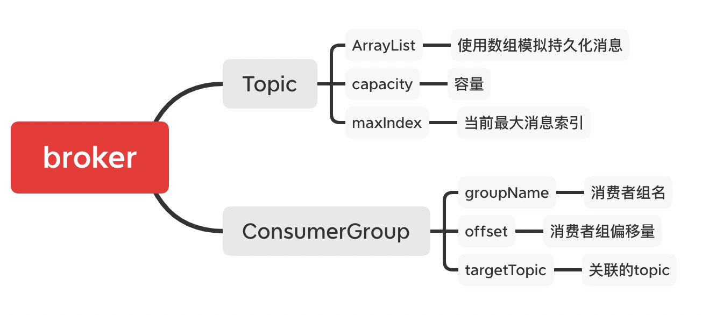
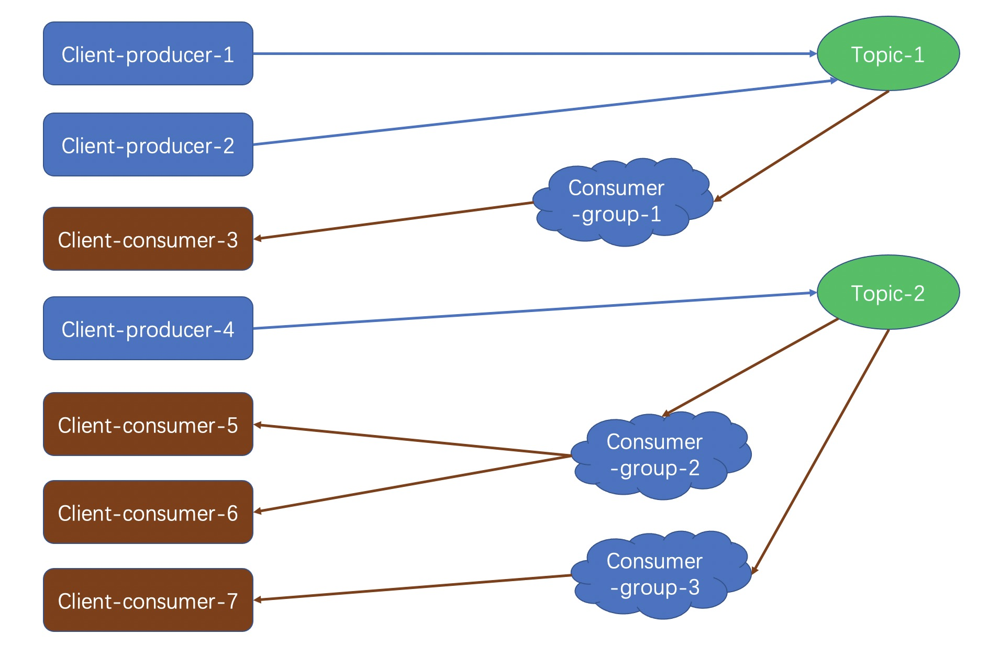

# 分布式消息-其他MQ与动手写MQ

仿照Kafka，从零开始自实现 MQ，实现了 Kafka 中 80% 的基础功能。学习 Kafka 的话如果只是看文章和源码，可能不久就会忘了，还是自己实现一个「精简版」的 Kafka 吧，

## 实现功能概览

1、基于内存Queue实现生产和消费API

- [X] 1） 创建内存Queue， 作为底层消息存储
- [X] 2） 定义Topic， 支持多个Topic
- [X] 3） 定义Producer， 支持Send消息
- [X] 4） 定义Consumer， 支持Poll消息

2、设计自定义Queue，实现消息确认和消费offset

- [X] 1） 自定义内存Message数组模拟Queue。
- [X] 2） 使用指针记录当前消息写入位置。
- [X] 3） 对于每个命名消费者， 用指针记录消费位置

3、拆分broker和client(包括producer和consumer)

- [X] 1） 将Queue保存到web server端
- [X] 2） 设计消息读写API接口， 确认接口， 提交offset接口
- [X] 3） producer和consumer通过httpclient访问Queue
- [X] 4） 实现消息确认， offset提交
- [X] 5） 实现consumer从offset增量拉取

## 项目设计及项目能力

### Server

#### 一、Topic

1. 维护ArrayList用于模拟持久化消息「原因：消息需要随机访问」
2. 设定消息队列容量，达到容量时无法再生产消息
3. 当前消息的最大索引

#### 二、ConsumerGroup

1. 消费者组由消费者组名和topic名共同决定，即不同topic的消费者组相互独立，不会相互影响
2. 需根据topic创建消费者组，即消费者组必须关联topic
3. 消费者组创建后，默认从头完整消费关联topic的所有消息
4. 同一个消费者组内，各个消费者总共消费一次「最少消费一次」所关联topic的所有消息

#### 三、broker

1. 一个broker关联一个ConsumerGroup列表和一个Topic列表
2. 通过broker暴露的接口，可以展示关联ConsumerGroup列表和Topic列表的概览信息
3. 通过broker暴露的接口，可以向一个topic中生产消息
4. 通过broker暴露的接口，可以根据消费者组名和topic名消费消息

注：本次仅实现单个broker，broker后实现了topic和consumerGroup「消费者组」，细节结构图如下：



### client

1. 客户端通过topic名生产消息
2. 客户端根据消费者组名和topic名消费消息
3. 客户端消费消息时，可以同时获得消费者组的offset「偏移量」
4. 客户端消费消息成功后，需手动更新消费者组的offset。若不更新，客户端默认无法消费后面的消息。
5. 客户端消费消息失败时，不应更新消费者组的offset。此时客户端可以重复消费当条消息。
6. 多个客户端可以使用同一个消费者组消费同一个topic；可以使用不同的消费者组消费同一个topic；可以使用不同的消费者组消费不同的topic

客户端工作示意图如下：



## 项目结构

本项目共提供四个module：

```
bitkylin-mq-server
bitkylin-mq-api
bitkylin-mq-client-producer
bitkylin-mq-client-consumer
```

各module的介绍如下：

### 1. bitkylin-mq-server

提供MQ服务端，提供broker以及其关联的ConsumerGroup和Topic等，主要实现如下功能：

- 展示MQ概览信息，包括topic和ConsumerGroup的详细信息
- 创建消费者组，创建消费者组后，即可使用该消费者组消费消息
- 生产消息，将消息发送至指定topic
- 基于指定消费者组消费消息，消费消息但不更新关联消费者组的offset
- 基于指定消费者组消费消息，消费消息且自动更新关联消费者组的offset
- 手动更新指定消费者组的偏移量

### 2. bitkylin-mq-api

提供供客户端使用的api，通过feignClient形式提供，客户端可直接使用，执行RPC，当前实现如下功能：
- 发送消息至指定topic
- 订阅指定topic的消息。自动创建消费者组，使用观察者模式轮询消息并消费。

### 3. bitkylin-mq-client-producer

消息生产客户端，通过feign-api生产消息，当前实现如下演示功能：
随机向topic名为「topic-1」和「topic-2」的topic中发送消息，每隔3秒发送一次消息。

### 4. bitkylin-mq-client-consumer

消息消费客户端，通过feign-api消费消息，当前实现如下演示功能：

- 创建消费者组「spring-group-1」订阅「topic-1」，并打印订阅的消息。
- 创建消费者组「spring-group-2」订阅「topic-2」，并打印订阅的消息。

## 代码演示

1. 运行module「bitkylin-mq-server」，启动MQ的broker，启动消息服务。
2. 运行module「bitkylin-mq-client-consumer」和「bitkylin-mq-client-producer」，开启消息订阅演示任务和消息发送演示任务。
3. 此时可通过「bitkylin-mq-client-consumer」的控制台，看到消息不断被消费。

```shell
2021-01-24 01:55:58.008  INFO 2516 --- [pool-1-thread-1] .c.c.BitkylinMqClientConsumerApplication : 收到消息：spring-group-1: topic-1-msg:1
2021-01-24 01:56:00.996  INFO 2516 --- [pool-1-thread-1] .c.c.BitkylinMqClientConsumerApplication : 收到消息：spring-group-1: topic-1-msg:2
2021-01-24 01:56:04.000  INFO 2516 --- [pool-1-thread-1] .c.c.BitkylinMqClientConsumerApplication : 收到消息：spring-group-1: topic-1-msg:3
2021-01-24 01:56:07.004  INFO 2516 --- [pool-2-thread-1] .c.c.BitkylinMqClientConsumerApplication : 收到消息：spring-group-2: topic-2-msg:4
2021-01-24 01:56:10.015  INFO 2516 --- [pool-2-thread-1] .c.c.BitkylinMqClientConsumerApplication : 收到消息：spring-group-2: topic-2-msg:5
2021-01-24 01:56:13.011  INFO 2516 --- [pool-2-thread-1] .c.c.BitkylinMqClientConsumerApplication : 收到消息：spring-group-2: topic-2-msg:6
2021-01-24 01:56:16.011  INFO 2516 --- [pool-2-thread-1] .c.c.BitkylinMqClientConsumerApplication : 收到消息：spring-group-2: topic-2-msg:7
2021-01-24 01:56:19.006  INFO 2516 --- [pool-2-thread-1] .c.c.BitkylinMqClientConsumerApplication : 收到消息：spring-group-2: topic-2-msg:8
2021-01-24 01:56:21.997  INFO 2516 --- [pool-1-thread-1] .c.c.BitkylinMqClientConsumerApplication : 收到消息：spring-group-1: topic-1-msg:9
2021-01-24 01:56:24.994  INFO 2516 --- [pool-1-thread-1] .c.c.BitkylinMqClientConsumerApplication : 收到消息：spring-group-1: topic-1-msg:10
2021-01-24 01:56:28.002  INFO 2516 --- [pool-2-thread-1] .c.c.BitkylinMqClientConsumerApplication : 收到消息：spring-group-2: topic-2-msg:11
2021-01-24 01:56:30.991  INFO 2516 --- [pool-1-thread-1] .c.c.BitkylinMqClientConsumerApplication : 收到消息：spring-group-1: topic-1-msg:12
2021-01-24 01:56:34.014  INFO 2516 --- [pool-2-thread-1] .c.c.BitkylinMqClientConsumerApplication : 收到消息：spring-group-2: topic-2-msg:13
2021-01-24 01:56:37.010  INFO 2516 --- [pool-2-thread-1] .c.c.BitkylinMqClientConsumerApplication : 收到消息：spring-group-2: topic-2-msg:14
2021-01-24 01:56:40.004  INFO 2516 --- [pool-2-thread-1] .c.c.BitkylinMqClientConsumerApplication : 收到消息：spring-group-2: topic-2-msg:15
```

4. 打开postman，发送如下请求创建专用于postman的消费者组：

```http request
POST http://localhost:8080/mq/broker/consumer-group/create

{
    "groupName": "postman-group-1",
    "topicName": "topic-1"
}
```

5. 发送如下请求即可消费消息，且自动确认「无需手动更新消费者组的offset」

```http request
POST http://localhost:8080/mq/broker/message/simple-pull

{
    "groupName": "postman-group-1",
    "topicName": "topic-1"
}
```
可以发现，postman可以独立消费指定topic的消息，不受Spring程序消费的影响。当然，postman可以直接使用Spring程序一致的消费者组，以共同消费消息。

此时查询MQ的概览信息：

```http request
GET http://localhost:8080/mq/broker/overview
```

响应：

```json
{
  "groupList": [
    {
      "groupName": "spring-group-1",
      "topic": {
        "name": "topic-1",
        "capacity": 1000,
        "maxIndex": 14
      },
      "offset": 15
    },
    {
      "groupName": "postman-group-1",
      "topic": {
        "name": "topic-1",
        "capacity": 1000,
        "maxIndex": 14
      },
      "offset": 5
    },
    {
      "groupName": "spring-group-2",
      "topic": {
        "name": "topic-2",
        "capacity": 1000,
        "maxIndex": 17
      },
      "offset": 18
    }
  ]
}
```

## 局限性

1. 每个topic的队列容量是固定的，队列满后拒绝生产消息，暂不支持清理历史消息。
2. 消息消费未加锁，如果一个消费者组的多个消费者高并发消费消息，可能导致同一条消息被消费多次。
