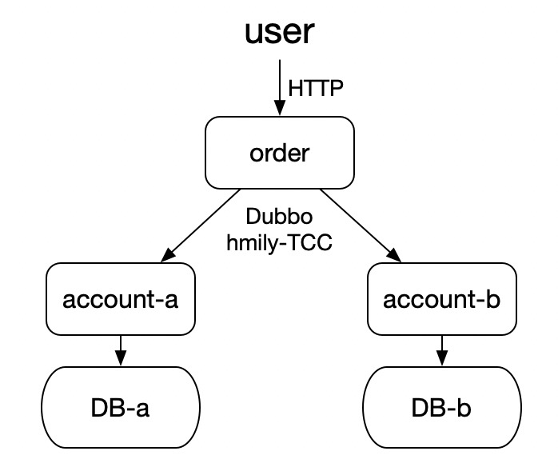

# 基于 dubbo + hmily 的多应用交易系统「演示版」

#### 实现功能
1. 交易双方两用户采用不同的应用、不同的数据库处理交易，需要保证一致性
2. 交易原子化拆分为Try、Confirm、Cancel三个步骤，交易异常时，采用TCC柔性事务保证最终一致性
3. 采用Dubbo完成微服务间调用，采用hmily保证TCC柔性事务

#### 总体设计

1. 提供Http-API，用于发起交易，底层资金结算拆分为两个服务：account-a、account-b
2. account-a、account-b两个应用是同构的、数据库也是同构的
3. 应用order与account使用dubbo进行通信
4. 应用order将account-a与account-b串联进行业务时，使用hmily-TCC保证事务
5. 应用order本身也是用hmily-TCC保证事务

   

#### 项目结构
- bitky-demo-order：应用order，包含controller，用于http请求进行交易
- bitky-demo-account：应用account
    - bitky-demo-account-common：应用account大多数业务代码的实现
    - bitky-demo-account-a：account-a应用，仅包含account-a特异的配置，无业务代码
    - bitky-demo-account-b：account-b应用，仅包含account-b特异的配置，无业务代码
- bitky-demo-api：提供dubbo-RPC接口
- bitky-demo-common：公共依赖，几乎包含全部用到的依赖，为了方便起见，依赖了mybatis、hmily 等spring boot starter

#### 快速启动

##### 1. 使用docker创建并启动容器
创建并启动两个数据库实例，一个zookeeper实例
```bash
docker run --name bitky-mysql1 -p 3306:3306 -e MYSQL_ROOT_PASSWORD=123 -d mysql
docker run --name bitky-mysql2 -p 3307:3306 -e MYSQL_ROOT_PASSWORD=124 -d mysql
docker run --name bitky-zookeeper  -p 2181:2181 -p 2888:2888 -p 3888:3888 -p 8080:8080  -d zookeeper
```

##### 2. 数据库初始化
分别在两个数据库实例中创建一个数据库，由于两个数据库是同构的，故采用同一套建库模板，建库模板参见文后的参考内容。

##### 3. 初始化hmily
由于hmily也需要一个单独的数据库，所以需要参考hmily官方文档，在任意数据库实例中创建hmily专属的数据库

##### 4. 启动应用
1. 启动两个account应用，参见module：bitky-demo-account-a与bitky-demo-account-b
2. account启动成功后，启动order，参见module：bitky-demo-order

##### 5. 调用接口发起交易
接口调用示例：
```http request
POST http://localhost:8085/transfer/transfer

{
    "bizSerial": "bizSerial2",
    "source": {
        "serviceName": "accountServiceA",
        "accountType": "RMB",
        "amount": 14,
        "uid": "user-a"
    },
    "target": {
        "serviceName": "accountServiceB",
        "accountType": "USD",
        "amount": -2,
        "uid": "user-b"
    }
}

```

#### 局限性
1. 由于无前置路由确定指定的用户数据在哪个数据库中、由哪个account应用处理，所以目前采用取巧的办法，直接由用户指定处理用户数据的应用服务名「采用serviceName字段」。

#### 参考内容
1. 建库模板
```SQL
CREATE TABLE `t_order` (
  `id` bigint NOT NULL AUTO_INCREMENT COMMENT '主键id',
  `uid` varchar(64) CHARACTER SET utf8mb4 COLLATE utf8mb4_0900_ai_ci NOT NULL COMMENT '用户id',
  `amount` bigint NOT NULL COMMENT '增加金额，单位分',
  `biz_serial` varchar(64) NOT NULL COMMENT '交易流水号',
  `account_type` varchar(64) NOT NULL COMMENT '账户类型RMB、USD',
  `finished` tinyint(1) NOT NULL DEFAULT '0' COMMENT '是否交易结束',
  `edition` int NOT NULL DEFAULT '1' COMMENT '版本号，乐观锁',
  `created_time` datetime NOT NULL DEFAULT CURRENT_TIMESTAMP COMMENT '创建时间',
  `updated_time` datetime NOT NULL DEFAULT CURRENT_TIMESTAMP COMMENT '更新时间',
  PRIMARY KEY (`id`) USING BTREE,
  UNIQUE KEY `uk_biz_serial` (`biz_serial`) USING BTREE,
  KEY `idx_uid` (`uid`) USING BTREE,
  KEY `idx_created_at` (`created_time`) USING BTREE,
  KEY `idx_updated_at` (`updated_time`) USING BTREE
) ENGINE=InnoDB DEFAULT CHARSET=utf8mb4;

CREATE TABLE `t_rmb_account` (
  `id` bigint NOT NULL AUTO_INCREMENT COMMENT '主键id',
  `uid` varchar(64) CHARACTER SET utf8mb4 COLLATE utf8mb4_0900_ai_ci NOT NULL COMMENT '用户id',
  `amount` bigint NOT NULL COMMENT '金额，单位分',
  `edition` int NOT NULL DEFAULT '1' COMMENT '版本号，乐观锁',
  `created_time` datetime NOT NULL DEFAULT CURRENT_TIMESTAMP COMMENT '创建时间',
  `updated_time` datetime NOT NULL DEFAULT CURRENT_TIMESTAMP COMMENT '更新时间',
  PRIMARY KEY (`id`) USING BTREE,
  KEY `idx_uid` (`uid`) USING BTREE,
  KEY `idx_created_at` (`created_time`) USING BTREE,
  KEY `idx_updated_at` (`updated_time`) USING BTREE
) ENGINE=InnoDB DEFAULT CHARSET=utf8mb4;

CREATE TABLE `t_usd_account` (
  `id` bigint NOT NULL AUTO_INCREMENT COMMENT '主键id',
  `uid` varchar(64) CHARACTER SET utf8mb4 COLLATE utf8mb4_0900_ai_ci NOT NULL COMMENT '用户id',
  `amount` bigint NOT NULL COMMENT '金额，单位分',
  `edition` int NOT NULL DEFAULT '1' COMMENT '版本号，乐观锁',
  `created_time` datetime NOT NULL DEFAULT CURRENT_TIMESTAMP COMMENT '创建时间',
  `updated_time` datetime NOT NULL DEFAULT CURRENT_TIMESTAMP COMMENT '更新时间',
  PRIMARY KEY (`id`) USING BTREE,
  KEY `idx_uid` (`uid`) USING BTREE,
  KEY `idx_created_at` (`created_time`) USING BTREE,
  KEY `idx_updated_at` (`updated_time`) USING BTREE
) ENGINE=InnoDB DEFAULT CHARSET=utf8mb4;

```
