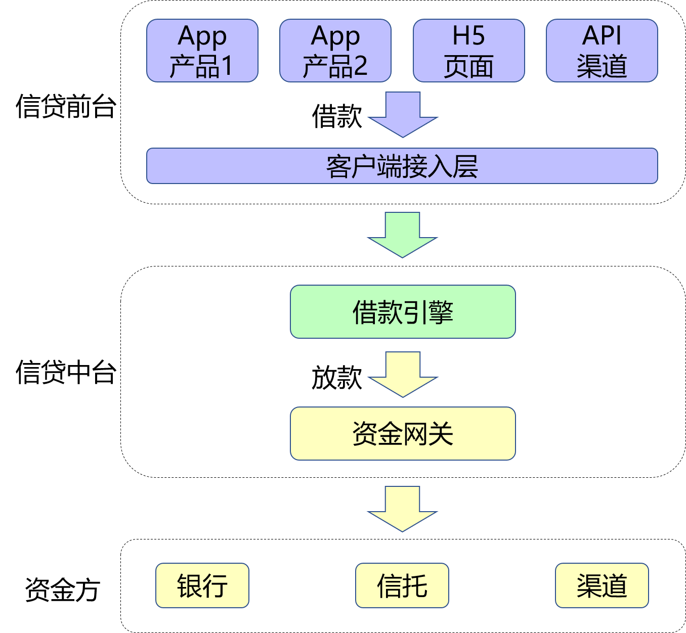
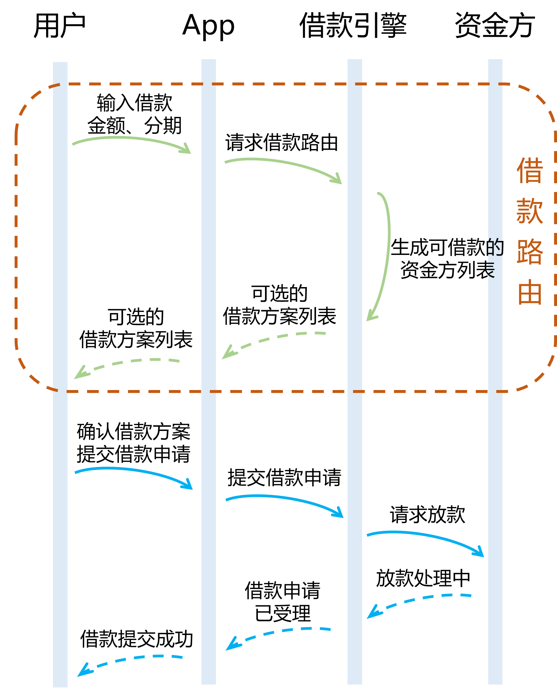
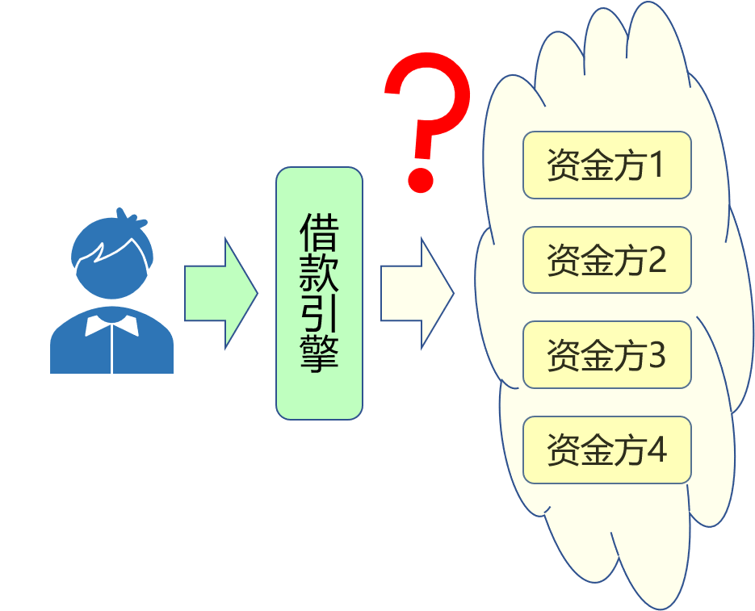
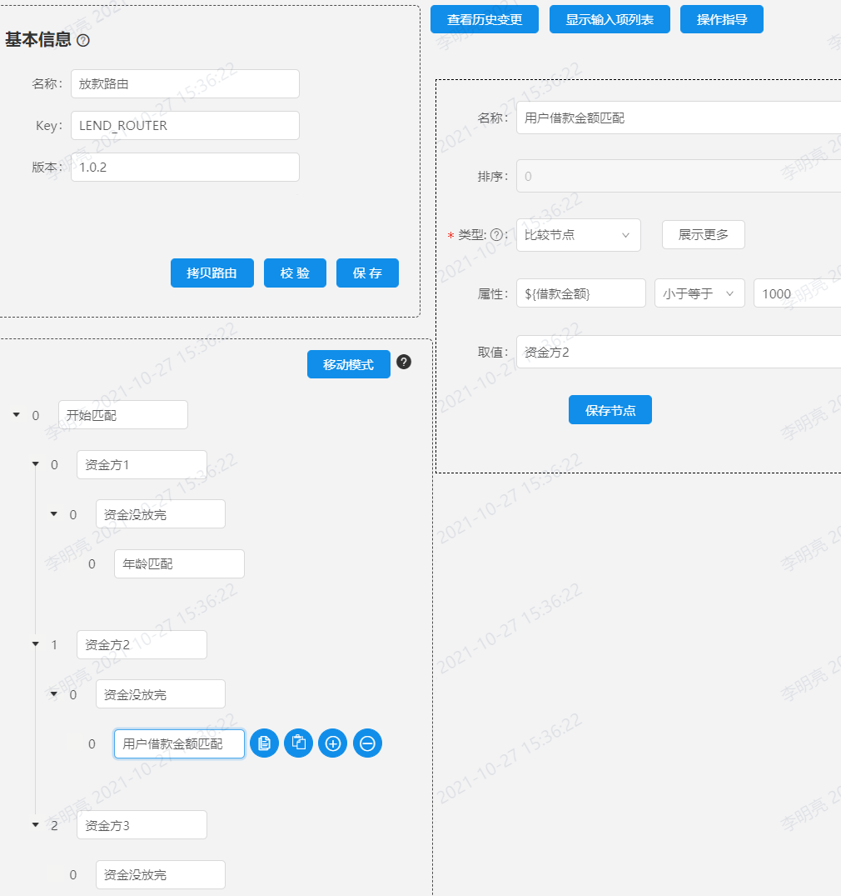
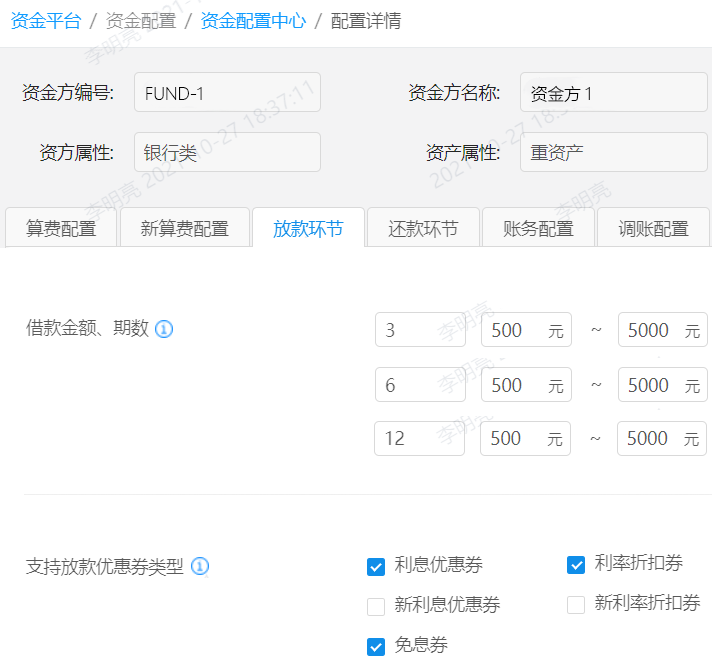
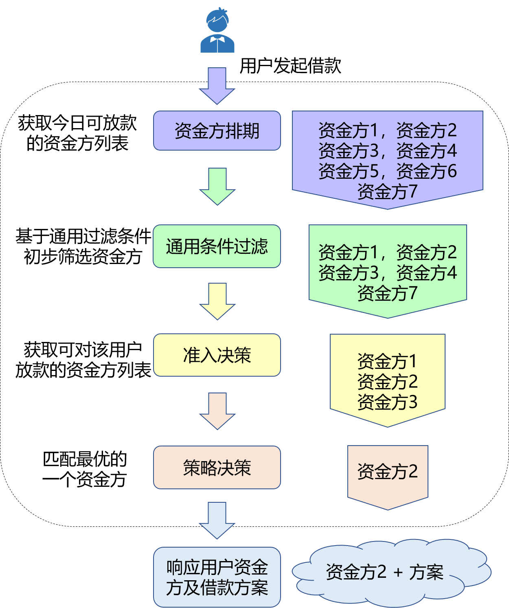
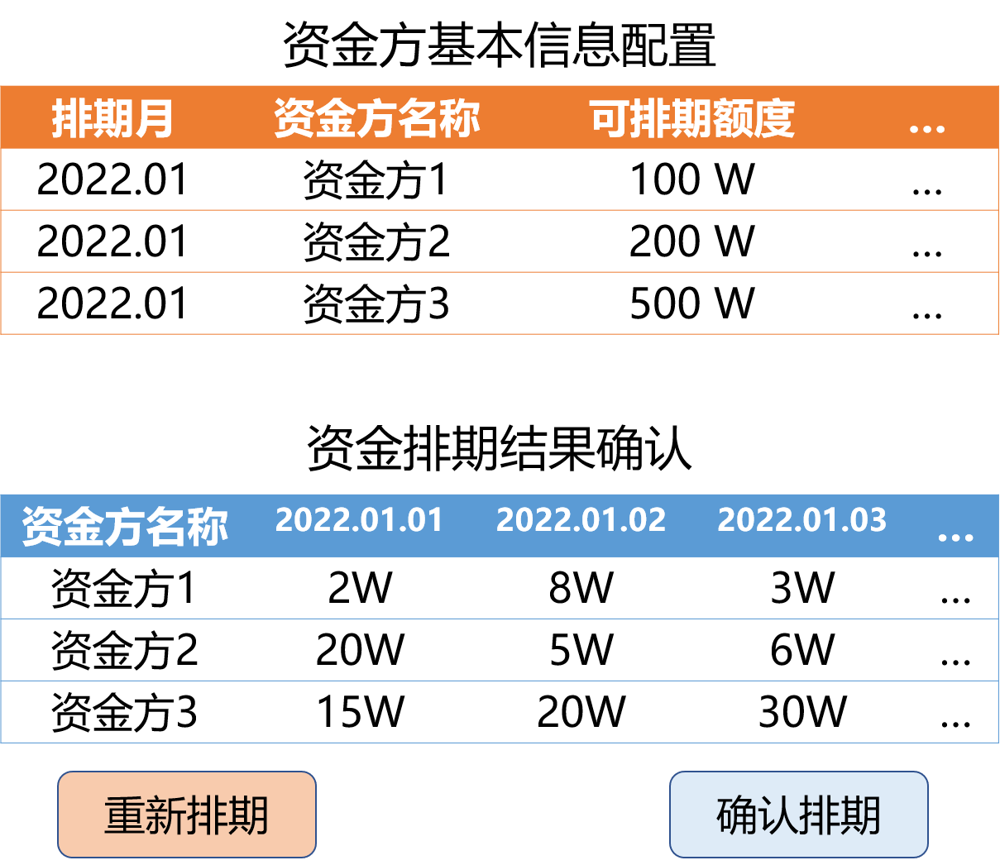
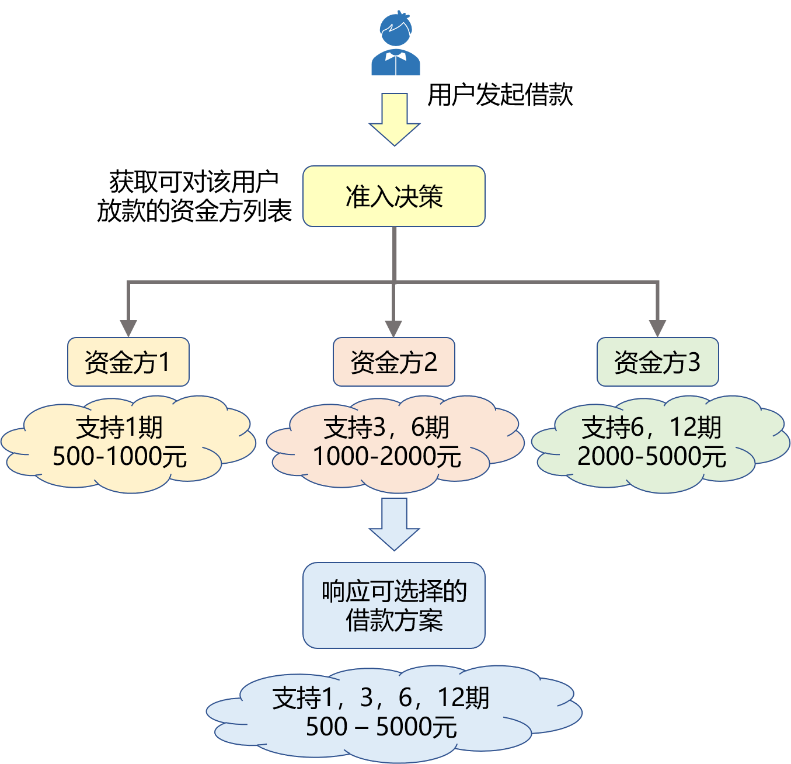
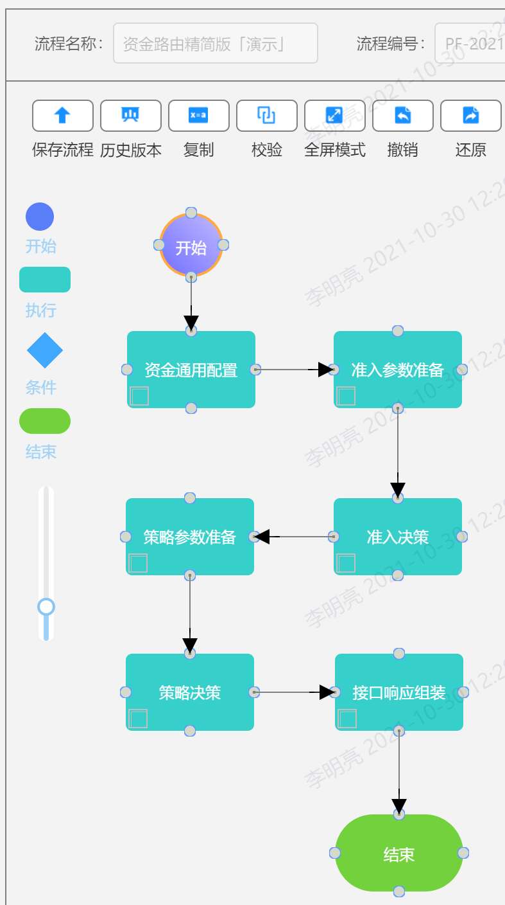
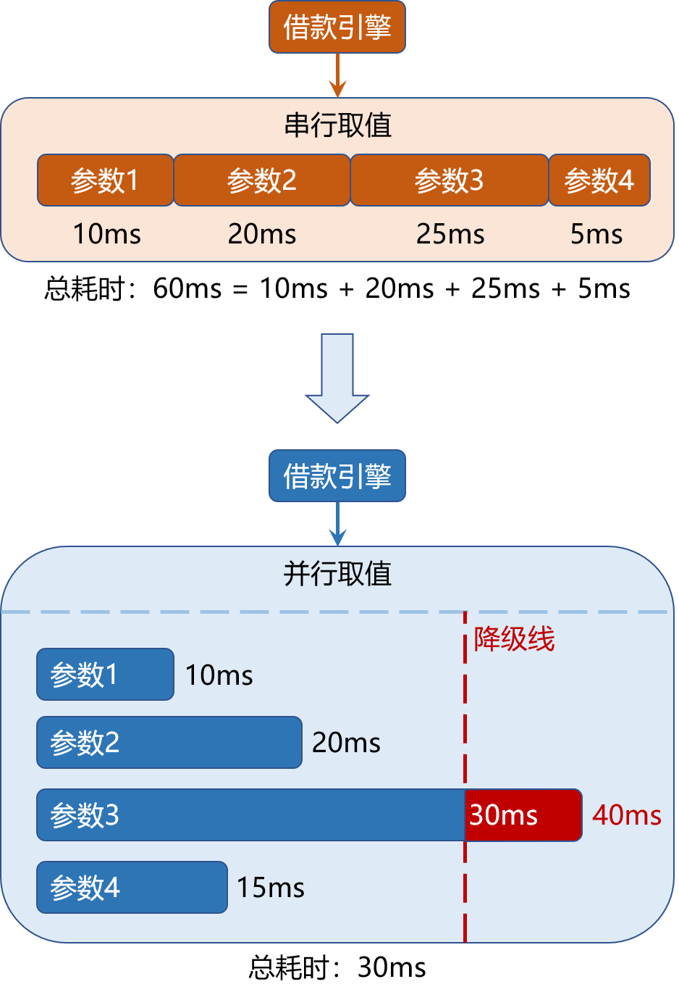

# 全面数字化建设之放款策略化的演进之路

> **文章概述：** 作为借款人和资金方的中介，当用户在平台发起借款请求时，如何为用户推荐最合适的资金方，是平台最基本也是最重要的能力，在放款策略化这条路上平台是如何进行探索的呢？

> **文章分类：** #架构演进 #借款路由 #放款策略化

## 1. 背景

几年的发展下，与平台合作的资金方越来越多。作为借款人和资金方的中介，当用户在平台发起借款请求时，如何为用户推荐最合适的资金方，是平台最基本也是最重要的能力，在放款策略化这条路上平台是如何进行探索的呢？


图：放款业务架构（演示版)

### 1.1 用户借款流程

用户借款流程交互如下：

1. 用户使用借款产品，选择借款金额和分期数。
2. 平台基于用户选择的金额和期数，匹配最合适的资金方，并算出用户的还款计划（比如每一期要还多少钱，每一期还款的本金、利息是多少等）。
3. 用户提交放款请求。
4. 系统基于用户选择的金额、期数，以及匹配到的资金方，完成对用户的放款。


图：借款流程时序图（演示版）

因为是精简版的时序图，所以看起来很简单，但其中仍有一个要点值得探讨（参见上图「借款路由」部分）：**与平台合作的资金方很多，但是系统是怎么选择出最适合当前用户的资金方的呢？**


图：如何匹配资金方

### 1.2 资金方匹配方案探讨

**方案一：轮询方式随机指定资金方**

第一次匹配时选择资金方1，第二次匹配时选择资金方2，第三次匹配时选择资金方3，第四次匹配时重新选择资金方1 ......

缺点：每个资金方支持的金额和分期并不一样；资金方每天放款的金额是有限制的；有些资金方有特殊限制 ......

由于每个资金方的放款规则都不同，所以不能采用轮询的方式随机指定资金方，我们需要根据用户的借款意愿、用户的个人信息、每日放款情况等等综合判断并为用户匹配最合适的资金方。

**方案二：代码实现资金方匹配规则**

为解决方案一遇到的问题，我们可以通过代码实现复杂的匹配规则，基本思想参考下面的伪代码：

```java
if (资金没放完(资金方1)) {
    if (年龄 <= 40) {
        return "资金方1";
    }
}
if (资金没放完(资金方2)) {
    if (年龄 <= 40) {
        if (用户借款金额 < 1000) {
            if (用户选择分期 in [3, 6, 12]){
                return "资金方2";
            }
         }
    }
}
if (资金没放完(资金方3)) {
... ...
```

这样的代码可以满足需求，甚至在精心对代码进行设计后，能够有较高的可读性、可扩展性等。

不过这样做有一个很大的问题：当商务同事隔几天就要求接入个新的资金方时，我们就需要根据需求开发复杂的匹配规则；当商务同事觉得之前某个资金方的规则不满意，隔几天就想要变更匹配规则时，这时开发工作就成为了纯粹的需求翻译工作，体现不出创造性。并且由于此类需求无穷无尽，故此处始终需要占用可观的开发资源。

## 2. 演进 1：借款路由 1.0

由于资金方的匹配规则会经常性的变化，导致始终需要维持明显的开发成本，那么解决方案就呼之欲出了：将资金方的匹配规则及相关复杂逻辑从业务代码中剥离出去，转由独立的决策模块完成。决策模块可以提供友好的配置页面，方便业务同事独立完成配置工作，从而释放出相应的开发资源。

### 2.1 演进方案

每当借款引擎收到匹配资金方的请求时，借款引擎会准备足够的参数，并将这些参数输入决策路由，决策路由经过计算后会吐出一个值，该值即代表某一个资金方。

每当业务方需要变更匹配规则时，只需要根据借款引擎提供的丰富的参数，独立在决策路由的配置页面完成规则的配置工作即可。


图：决策路由 - 借款路由规则（演示版）

> 决策路由的基本原理：决策路由配置完毕后，会形成一颗决策树，决策树上有多个决策节点，每个决策节点上均维护有独立的匹配规则。每次执行业务决策时，均会从头开始对整个决策树进行遍历，采用深度优先遍历（DFS）的思想，对遍历过程中访问的每一个决策节点执行相应的匹配规则，匹配失败时会跳过该决策节点，匹配成功时会检查其是否配置有决策子树，有子树时继续访问子树，无子树时直接返回当前决策节点的取值。

当然，有时候业务同事在配置决策树时，借款引擎默认给出的参数可能并不够，业务同事希望能够提供一些额外的参数，比如：用户使用的客户端版本、用户的手机系统类型、用户使用的借款产品类型等。当然这也没有问题，开发同事只需要基于需求开发相应的输入参数即可，增加通用的输入参数与变更复杂的匹配规则相比，开发工作量要小的多。


### 2.2 演进 1 结果总结

借款路由演进至 1.0 版本后，具有以下特点：
1. 资金方匹配规则由业务同事独立设计与实现，对于开发同事和业务系统均无感知，有利于明确业务同事和开发同事各自的职责。
2. 将基本不变的业务流程代码与经常变动的资金方匹配规则剥离，两者独立发展，可保证通用业务流程的整体稳定性。
3. 释放了维护复杂匹配规则的开发资源，但增加了业务同事配置的工作量。

### 2.3 借款路由 1.0 遇到的问题

借款路由 1.0 上线后，效果很好，稳定工作一年后，开始逐步暴露出一些问题：

1. 资金方规则匹配的复杂逻辑完全从代码中抽离了出来，开发同事的工作量明显减少，但随着合作的资金方越来越多，决策路由的匹配规则也越来越复杂，配置经常出错，每天都有相关的问题产生且需要排查，总之决策路由的维护成本越来越高。
2. 每个资金方支持的分期范围和金额范围都有可能不同，且针对不同的用户，不同资金方的支持也都有所不同。然而用户借款时看到的是同一套可供选择的金额范围和分期范围方案，这套方案虽然经过了精心的人工设计，但仍然难以满足所有用户的需求，例如：用户选择了某个不支持的金额和分期，导致无法匹配到可用的资金方，从而无法成功提交借款请求。
3. 当用户发起借款请求时，我们需要根据资金排期结果获取资金方列表，而后才能为用户匹配最合适的资金方。每日可放款的资金方列表都有所不同，当前资金排期工作是由商务同事手动完成的，每日均需要占用可观的人力成本，且资金排期结果未能达到最优。

## 3. 演进 2：借款路由 2.0

针对以上问题，我们提出了如下新的设计方案。

### 3.1 演进方案

#### 3.1.1 通用资金方配置及匹配规则单独维护

我们通过研究决策路由上配置的规则后发现，虽然规则过于繁杂，但是其中部分规则具有共性。虽然不同资金方匹配规则的具体取值不同，但是匹配的逻辑是一致的，没必要在决策路由中一遍又一遍重复配置同一类规则，这类规则完全可以剥离出来由代码实现，从而明显减轻决策路由中匹配规则的复杂性。

> 自研资金配置中心：使用统一的维护页面，单独配置各个资金方共有的静态配置，且可以在代码中维护相应的匹配规则，从而减轻决策路由的负担。


图：资金配置中心 - 资金方配置（演示版）

#### 3.1.2 单个决策路由拆分为两个决策模块

对决策路由进行重构，将决策路由整体上分为两个决策模块：准入模块和策略模块。准入模块主要用于生成可借款的资金方列表（详细说明参加下一小节），进而生成用户可选择的借款方案。用户选择借款方案后，会经过策略模块，用于从刚刚生成的资金方列表中匹配最合适的资金方。两个决策模块职责分明，每个模块相比于原先的决策路由复杂性均大大减小。


图：借款路由 2.0 流程图（演示版)

#### 3.1.3 基于 AI 模型算法智能生成资金排期

我们使用 AI 实验室研发的模型算法，自动生成最优的资金排期组合，尽可能满足用户的放款需求。由于资金排期计划由 AI 模型算法自动生成，商务同事仅需完成资金方基本放款额度等信息的配置即可，极大节省了人力成本，并且每年可以优化节约可观的资金成本。



图：智能资金排期（演示版）

#### 3.1.4 用户可选借款方案的动态生成

如 3.1.2 节所述，决策路由整体上分为准入模块和策略模块。用户发起借款时，先过准入模块，得到一个资金方列表，须保证该列表中的资金方，对当前用户均可放款。将这些资金方支持的借款金额范围、支持的借款分期范围等取并集，即可得到用户可选择的借款金额、分期范围，根据不同的用户属性可生成最适合当前用户的可选借款方案。


图：动态生成用户可选择的借款方案（演示版）

经过以上操作，动态生成的方案经过用户任意选择后，大概率能匹配到至少一个资金方。当然了，如果实在没有匹配成功，系统会自动向用户推荐最合适的借款方案，尽可能提升用户的借款成功率。

#### 3.1.5 基于业务流引擎完全重构借款路由

通过前几小节的说明及配图，我们知道，借款路由 2.0 相比于借款路由 1.0，代码实现复杂了很多。为了减轻业务规则配置的复杂度，部分原本由决策路由实现的匹配规则转由业务代码实现；为了扩展更多的业务能力，借款路由新增了部分业务处理逻辑。

从「借款路由 2.0 流程图」中可以看到，整个借款路由由多个逻辑分明的处理模块组成，相关的代码可基于图中的业务逻辑按照流程逐步进行实现，所以我们借助公司自研的业务流引擎，对借款路由进行了重构。

> 业务流：即工作流（Workflow），将业务流水线化，可将原先聚在一起较多耦合的处理逻辑拆分为相互关联的若干个处理模块，每个模块职责单一，具有较高的内聚性。业务数据在模块之间流转同时经由各个模块处理，业务逻辑清晰明确。

使用公司自研的业务流引擎重构借款路由，具有以下优势：

**1. 业务流程可读性提升**

通过代码实现原子化的业务模块后，可以通过配置页面将已实现的业务模块进行关联和展示，每个业务模块的职责清晰明确。用于单个业务模块开发的模版代码如下：

```java
@BizFlowModule(name = BizFlowModuleEnum.DEMO)
public class BfLendApplyDemoModule extends AbstractBizFlowModule {

    @Override
    public ProcessResult process(ProcessContext<FundRouteContext> processContext) {
        return createSuccessProcessResult();
    }
}
```

只需要在模板类的示例方法中填入业务逻辑即可完成开发工作。可以在配置页面完成业务模块间的分支处理、异常处理，将相关逻辑从业务代码中抽离出来，有利于实现业务模块的单一职责，高内聚。

**2. 业务流程可编排，可维护性提升**

由于单个业务模块职责单一，且具有较高的内聚性。当需要进行模块内的逻辑变更时，完全可以重新实现该模块，并在业务流层面直接完成新老模块的灰度替换；当在业务流程层面需要进行逻辑增减、业务调整时，可以简单通过增减模块、调整模块顺序实现。以上措施有力保证了业务的整体稳定性和可维护性。


图：业务流引擎 - 借款路由 2.0（演示版)

### 3.2 演进 2 结果总结

1. 对决策路由中复杂的匹配规则重新进行梳理，将通用的资金方配置单独维护，通用匹配规则抽离到业务代码中实现，并对决策路由进行拆分，简化单个决策模块内部匹配规则的复杂度，提升决策模块本身的可维护性，明显降低了匹配规则的维护成本。
2. 基于 AI 智能排期生成最优的资金方列表，而后针对不同用户匹配可借款的资金方列表，进而生成最优的可选借款方案供用户选择，明显增加了用户与资金方匹配的成功率。
3. 使用业务流引擎重构借款路由，提升了借款路由相关代码的可读性、可维护性和稳定性。

### 3.3 借款路由 2.0 遇到的问题

基于前面的设计，借款路由整体已经趋于完善了，看起来已经没有了太多的改进空间，实际则不然。在一段时间的维护过程中，我们发现，借款路由还是有棘手的问题需要改进。

1. 随着决策输入参数的增加，取值耗时也在线性增加，导致有时用户与资金方的匹配耗时长达 10 秒，严重影响了用户体验，急需优化。
2. 随着时间的推移，合作的资金方越来越多，产品的运营也越来越精细化，借款引擎需要开发的决策输入参数也越来越多，导致原先并不受关注的决策输入参数开发工作量越来越重，给开发团队增加了不小的负担。输入参数过多过杂，又使得借款引擎耦合了过多且并不需要关心的业务系统以及参数获取逻辑。

针对以上问题，我们再次提出了新的设计方案。

## 4. 演进 3：借款路由 3.0

### 4.1 演进方案

#### 4.1.1 使用特征平台管理和配置特征

**1. 数据调研**

对决策输入参数进行统计分析，我们逐渐发现，这些参数可以分为两类：

第一类是借款流程必知的参数，以下简称借款流程参数，这些参数借款引擎本身就需要知道，甚至有些参数可能就只有借款引擎知道，所以借款引擎开发这些输入参数无可厚非。

第二类需要借款引擎耦合其他业务系统并计算得到，以下简称外部依赖参数。

所以我们进行如下设计：**使用公司自研的特征平台，接管外部依赖参数的获取及计算。**

**2. 特征平台的使用**

> 在本文中，「特征」和「决策输入参数」两个概念含义一致。

特征平台管理并维护多种类型的特征，借款路由的常用特征如下：
1. 离线特征：基于 Hive 数据，编写 Hive SQL 生成。
2. （准）实时特征：基于流式计算生成。

基于大数据部门开发、维护的特征平台，当用户（主要是业务同事）希望开发新的特征时，优先直接使用已有的特征；当已有的特征无法满足要求时，可基于已有的模块化的特征，组装、计算并生成新的特征；如果仍未能满足要求，可采用传统方式提需求让开发同事实现新的特征。

绝大多数特征均可由业务同事自主高效实现，能够极大提升新特征上线的时效性。借款路由需要执行决策时，可以基于特征平台高效获取所需的所有特征参数，可明显提升特征参数获取的时效性。

#### 4.1.2 特征取值耗时优化

根据上一小节的方案进行改造，之前遇到的两个问题基本都得到了解决，用户与资金方的匹配耗时降到了 2 秒左右，已经达到了优化目标，然而业务同事又提出了新的要求，希望继续优化整体耗时。所以我们对借款路由的实现细节进行了进一步的梳理。

我们发现，对于借款流程特征，借款路由业务代码本身需要使用，如果特征平台和借款引擎均重复进行取值，不但会导致资源的浪费，更重要的是会影响到借款路由整体的时效性，进而影响用户体验，所以仅借款引擎自身做了取值工作。对借款流程特征的取值逻辑，我们可以继续优化：

1. 将借款流程特征参数取值逻辑，简单由串行改为使用线程池并行取值，即可大大减少特征参数取值的整体耗时。

2. 基于木桶原理，特征取值的整体时效性基本取决于耗时最久的那个特征的取值用时，所以在借款流程特征取值用时超出阈值时，果断进行降级处理，即可有力保证整体耗时的稳定性。

   

图：并行取值及超时降级

### 4.2 演进 3 结果总结

1. 借款引擎将外部依赖参数进行剥离，并由特征平台统一管理，解除了借款引擎与多数业务系统的耦合，大大减轻了借款引擎的开发负担。借助特征平台的能力，明显提升了特征获取的时效性。
2. 借款引擎特征取值细节优化，采用了多种方法，如：串行转多线程并行取值，取值超时降级等，进一步提升了借款路由整体的时效性以及耗时的稳定性。

## 5. 借款路由演进总结

1. **公司较强的技术能力和丰富的技术工具能够有效为业务赋能。** 以上设计深度整合了公司自研的决策路由、资金配置中心、业务流引擎、资金排期 AI 模型算法、特征平台等基础设施，若公司未能提供上述技术组件、服务，借款路由难以优化到满意的水平。
2. **技术演进需要一步一步踏实实施，且每一步均目标明确，即可达成较好的结果。** 借款路由的每次演进均是为了解决明确的问题，或对某业务场景能带来明显的优化提升，具有很强的目的性，最终基本都能够达成预定的目标。
3. **技术演进切忌直接设计大而全的目标，一步到位不可取。** 业务知识需要在具体的工作实践中逐步积累，业务问题也会逐步变得明确，在工作实践中一步步解决业务痛点，量变引起质变，即可稳健达成最终的目标。如果一开始直接设计一个大而全的目标，基本都会因为研发成本高、外部支持不足而难以推进。就算能够推进，因为未能了解真正的业务痛点，最终实现的结果极有可能与真实的需求相去甚远。

## 6. 展望

1. **采用 AI 算法智能执行资金方匹配。** 上述历次演进，完成了资金方匹配决策模块的剥离及匹配规则的灵活配置，但本质上仍需要人工配置各种匹配规则，占用了明显的人力成本，且匹配规则受主观影响无法达到最优。后续我们会采用 AI 算法执行资金方匹配，进一步降低人力成本，进一步提高放款成功率。
2. **借款路由进一步优化容灾能力。** 根据演进 3 结果可知，借款路由深度绑定了特征平台，使用特征平台提供的能力完成大部分特征的获取。特征平台耦合了众多服务并基于这些服务产出各种特征，此时一个外部服务响应超时就可能导致外部依赖特征整体取值超时，从而明显影响到借款路由的可用性。后续我们会优化借款路由的容灾能力及降级策略，进一步提升借款路由的可用性，优化用户体验。

