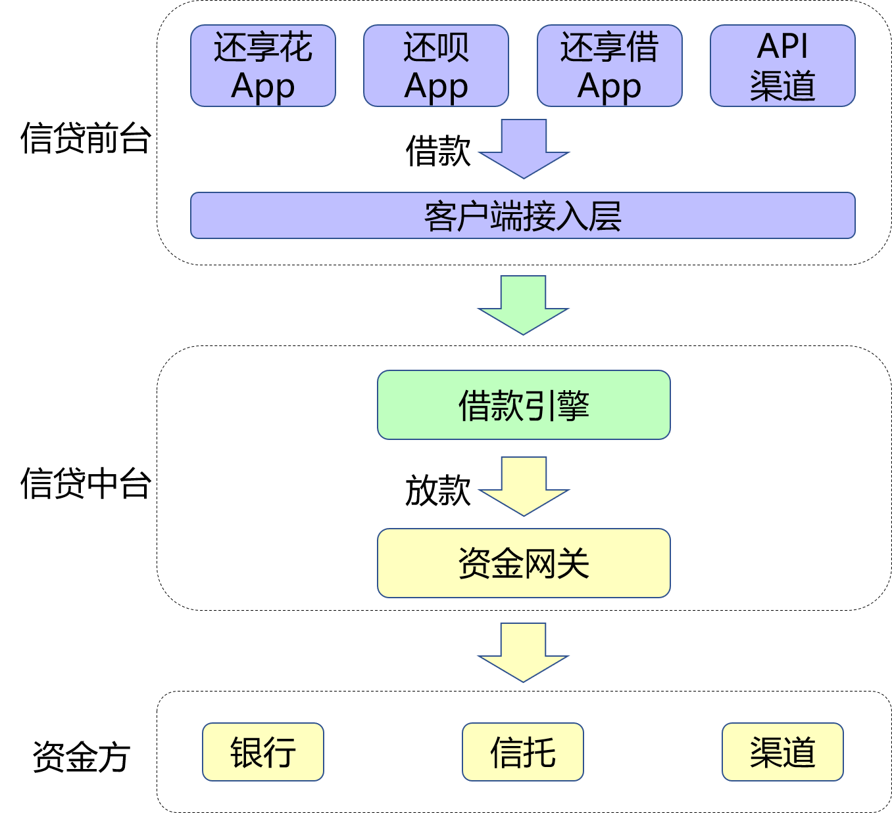
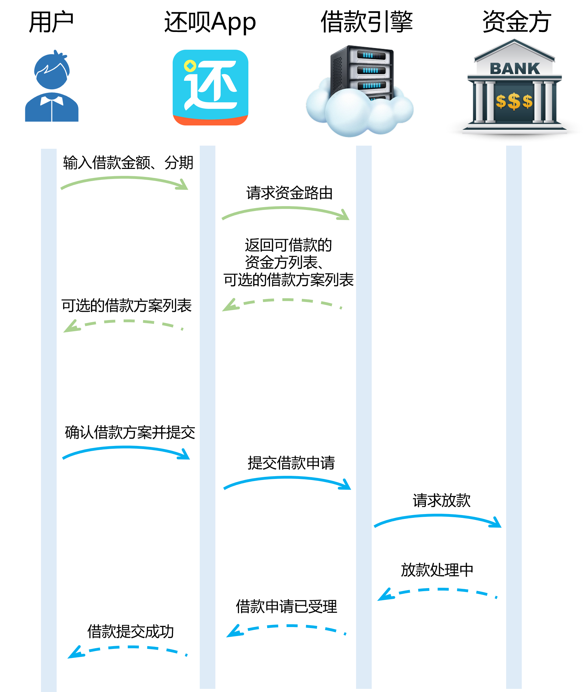
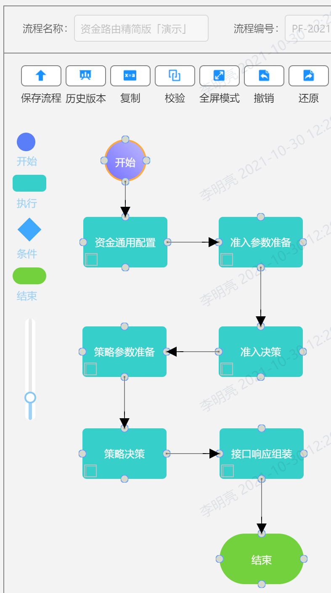

# 题目：全面数字化建设之放款策略化的演进之路

## 1. 背景
还呗最初是一款信用卡账单分期 App，服务广大信用卡持卡人，帮用户解决信用卡难题。而后还呗衍生出了多种产品形态，如面向年轻人提供账单分期和商品分期等多种服务。用户可在购物、消费、还款场景下，享受更灵活、更便捷、更高效的分期生活服务。

虽然产品形态多样，但本质上还呗为用户提供的是小额贷款服务。由于还呗并无自有资金，是一个助贷平台，并且在还呗几年的努力下，与还呗合作的资金方很多，作为借款人和资金方的中介，当用户在还呗平台发起借款请求时，如何为用户推荐最合适的资金方，是还呗的一项最基本也是最重要的能力。

> 备注：「助贷业务」是指助贷机构利用自身掌握的获客、风控及贷后管理优势，向资金方(包括持牌金融机构、类金融机构)推荐借款人，经资金方风控终审后，完成发放贷款，并获取相关服务费的业务。



### 1.1 用户借款流程
用户打开还呗App后，选择使用的产品，比如选择了产品「还信用卡」。

之后打开借款方案选择页面，用户需要选择借款金额和还款的分期数。


选择之后，系统会自动基于金额和期数，匹配最合适的资金方，并算出用户的还款方案（比如每一期要还多少钱，每一期还款的本金、利息是多少等）


用户确认过之后，就提交借款成功了。


之后，系统会基于用户选择的金额、期数，以及系统匹配到的资金方，使用该资金方的资金完成对用户的放款。



因为是精简版的流程图，所以看起来很简单，但是其中有一个要点是值得探讨的：与还呗合作的资金方很多，但是系统是怎么选择出最适合当前用户的资金方的呢？

### 1.2 资金方匹配方案探讨

**方案一：轮询方式**

[借款引擎 -> 资金方1，资金方2，资金方3]()

第一次匹配时选择资金方1，第二次匹配时选择资金方2，第三次匹配时选择资金方3，第四次匹配时重新选择资金方1 ......

缺点：每个资金方支持的金额和分期并不一样；资金方每天放款的金额是有限制的，金额放完后就不能再放款了；有些资金方只支持40岁以下的用户借款，而有些资金方则不作限制......

由于每个资金方的放款规则都不同，且会根据用户的借款意愿、用户的个人信息、每日放款情况等等综合判断并匹配最合适的资金方，所以不能采用轮询的方式决定资金方。

**方案二：代码实现资金方匹配策略**

比如写如下伪代码：

```java
if (资金没放完(资金方1)) {
    if (年龄 <= 40) {
        return "资金方1";
    }
}
if (资金没放完(资金方2)) {
    if (年龄 <= 40) {
        if (用户借款金额 < 1000) {
            if (用户选择分期 in [3, 6, 12]){
                return "资金方2";
            }
         }
    }
}
if (资金没放完(资金方3)) {
... ...
```

这样写可以满足需求，甚至代码设计的比较好的情况下，能够有较高的可读性、可扩展性等。

这样做有一个很大的问题：当商务同事隔几天要求接入个新的资金方，并需要根据需求开发复杂的匹配规则；当商务同事隔几天就觉得之前某个资金方的规则不满意，想要更改匹配规则时，这时开发工作变成了纯粹的需求翻译工作，体现不出创造性，且在此处始终需要维持明显的开发成本。

## 2. 演进1：借款路由 1.0
由于资方的匹配规则会经常性的变化，导致始终需要维持明显的开发成本，那么解决方案就呼之欲出了：将资方的匹配规则及相关复杂逻辑从业务代码中剥离出去，转由独立的决策模块完成，决策模块可以提供友好的配置页面，方便业务同事独立完成配置工作。

### 2.1 方案设计

每当借款引擎收到匹配资金方的任务时，借款引擎会准备足够的参数，并将这些参数输入决策路由，决策路由经过计算后会吐出一个值，该值即代表某一个资金方。

每当业务方需要变更匹配规则时，只需要根据借款引擎提供的丰富的参数，独立在决策路由的配置页面完成规则的配置工作即可。


决策路由基本用法

> 决策路由配置后，会形成一颗决策树，决策树上有多个决策节点，每个决策节点上均维护有独立的匹配规则。每次决策执行时，均会对决策树进行遍历，采用深度优先遍历（DFS）的思想，对遍历过程中访问的每一个决策节点执行匹配规则，匹配失败时会跳过该决策节点，匹配成功时会检查是否有决策子树，有子树时继续访问子树，无子树时直接返回当前决策节点的取值。

当然，有时候，借款引擎默认给出的参数可能并不够，需要补充一些参数，比如：用户使用的客户端版本、用户的手机系统类型、用户使用的借款产品类型等。当然这也没有问题，增加通用的输入参数与变更匹配规则相比，开发工作量要小的多。

用户 -> 还呗 -> 借款引擎 -> 决策路由：输入借款金额、分期；匹配资金方


### 2.2 总结
采用决策路由有以下特点：
1. 资金方匹配规则由业务同事独立设计与实现，对于开发同事和业务系统均无感知。
2. 将基本不变的业务流程代码与经常变动的资金方匹配规则剥离，两者独立维护，可保证通用业务流程的整体稳定性。
3. 明显减轻业务系统的开发压力，但增加了业务同事配置的工作量。

### 2.3 问题
该方案设计出来后，效果很好，稳定工作了一年，而后开始逐步暴露出问题了：

1. 资金方规则匹配的复杂逻辑完全从代码中抽离了出来，开发同事的工作量明显减少，但随着资金方越来越多，规则越来越复杂，决策路由的配置也越来越复杂，配置经常出错，每天都有相关的问题产生且需要排查，总之决策路由的维护成本越来越高。
2. 每个资金方支持的分期范围和金额范围都有可能不同，且针对不同的用户，每个资金方是否可以支持也都有所不同。用户借款时看到的是同一套可供选择的金额范围和分期范围方案，这套方案虽然经过了精心的人工设计，但仍然难以满足所有用户的需求，容易发生这样的问题：用户选择了某个不支持的金额和分期，导致无法匹配到可用的资方，从而无法成功提交借款请求。

## 3. 演进2：借款路由 2.0

针对以上问题，我们提出了新的设计方案

### 3.1 演进方案

#### 3.1.1 剥离及使用资金方的静态配置

决策路由维护的规则过于繁杂，其中有些配置具有共性，虽然不同资金方匹配规则的具体取值不同，但是匹配的逻辑是一致的，没必要在决策路由中一遍一遍重复配置同一类规则，这类规则完全可以剥离出来由代码实现，从而明显减轻决策路由的负担。

> 使用资金配置中心，使用统一的维护页面，单独配置各个资金方共有的静态配置。这些配置可以独立在代码中维护匹配规则，从而减轻决策路由的负担。如各个资金方支持的分期范围和金额范围、资金方支持的借款优惠券类型等。


#### 3.1.2 实现用户可选择借款方案的动态生成

对决策路由整体进行重构，将决策路由整体上分为两个决策模块：准入模块和策略模块。用户要发起借款时，先过准入模块，得到一个资金方列表，须保证该列表中的资金方，当前用户均可用于借款。将这些资金方支持的借款金额范围、支持的借款分期范围等取并集，即可得到用户可选择的借款金额、分期范围。根据不同的用户特征可生成最合适的可选择的借款方案。经过以上操作，可保证该借款方案用户任意选择后，均能匹配到至少一个资金方，大大增加了用户的借款成功率。

#### 3.1.3 将单个决策路由拆为两个决策模块
对决策路由整体进行重构，将决策路由整体上分为两个决策模块：准入模块和策略模块。准入模块主要用于生成可借款的资金方列表，进而生成用户可选择的借款方案；用户选择借款方案后，会经过策略模块，用于从刚刚生成的资金方列表中匹配最合适的资金方。两个决策模块职责分明，单个模块相比于原先的决策路由复杂性均大大减小。


#### 3.1.4 基于业务流引擎重构整个决策路由

通过上图，我们可以知道，资金路由2.0相比于资金路由1.0，代码实现复杂了很多，因为为了减轻业务规则配置的复杂度，部分原本由决策路由实现的匹配规则需要需要转由业务代码实现，为了扩展更多的业务能力，资金路由新增了部分业务处理逻辑。但是从流程图中可以发现，整个借款路由由多个逻辑分明的处理模块组成，相关的代码可基于上图的业务逻辑按照流程逐步进行实现，所以我们借助公司的技术能力，采用了如下最佳实践：基于公司自研的业务流引擎对资金路由进行了重构。

> 业务流：即工作流（Workflow），可将业务流水线化，可将原先聚在一起较多耦合的处理逻辑拆分为相互关联的若干个处理模块，每个模块职责单一，具有较高的内聚性。业务数据在模块之间流转同时经由各个模块处理，业务逻辑清晰明确。

使用公司自研的业务流引擎重构资金路由，具有以下优势：

##### 3.1.4.1 增强业务流程的可读性

通过代码实现原子化的业务模块后，可以通过配置页面将已实现的业务模块进行关联和展示，每个业务模块的职责清晰明确。单个业务模块开发的模版代码如下：

```java
@BizFlowModule(name = BizFlowModuleEnum.DEMO)
public class BfLendApplyDemoModule extends AbstractBizFlowModule {

    @Override
    public ProcessResult process(ProcessContext<FundRouteContext> processContext) {
        return createSuccessProcessResult();
    }
}
```

只需要在模板方法中填入业务逻辑即可完成开发工作。可以在配置页面完成业务模块间的分支处理、异常处理，将相关逻辑从业务代码中抽离出来，有利于实现业务模块的单一职责，高内聚。

##### 3.1.4.2 业务流程可编排，增强可维护性

由于单个业务模块职责单一，且具有较高的内聚性，若需要模块内逻辑变更时，可完全重新实现该模块，并在业务流层面直接完成新老模块的灰度替换。若在业务流程层面需要进行逻辑增减、业务调整，则可以简单通过增减模块，调整模块顺序实现。以上措施有力保证了业务的整体稳定性和可维护性。

资金路由的精简版业务流示意图如下：



### 3.2 总结
1. 对决策路由中复杂的匹配规则重新进行梳理，将通用的资金方配置单独维护，通用匹配规则（如通用资金方匹配规则）抽离到业务代码中实现，并对决策路由进行拆分，简化单个决策模块内部匹配规则的复杂度，提升决策模块本身的可维护性，有力降低了匹配规则的维护成本。
2. 针对不同用户匹配可借款的资金方列表，进而展示最合适的可选借款方案供用户选择，大大增加了用户与资金方匹配的成功率。
3. 使用业务流引擎重构资金路由，大大增加了资金路由相关代码的可读性、可维护性和稳定性。

### 3.3 问题
基于前面的设计，借款路由整体看起来好像已经完美了，应该没有太多改进的空间了，实际则不然。在一段时间的维护过程中，我们发现，借款路由还是有棘手的问题需要改进。

1. 随着决策输入参数的增加，取值耗时也在线性增加，导致有时用户与资金方的匹配耗时有时长达10秒，严重影响了用户体验，急需优化。
2. 随着时间的推移，与还呗合作的资金方越来越多，对产品的运营越来越精细化，借款引擎需要开发的决策输入参数也越来越多。导致原先并不受关注的决策输入参数开发工作量越来越重，给开发团队增加了不小的负担。输入参数过多过杂，又使得借款引擎耦合了过多并不需要关心的业务系统和参数获取逻辑。

针对以上问题，我们再次提出了新的设计方案。

## 4. 演进3：借款路由 3.0

### 4.1 演进方案

#### 4.1.1 使用特征平台管理和配置特征

##### 4.1.1.1 数据调研

对决策输入参数进行统计分析，我们逐渐发现，这些参数可以分为两类：

第一类是借款流程必知的参数，以下简称借款流程参数，如：本次用户借款的金额、期数、借款银行卡、还款银行卡等，这些参数借款引擎本身就需要知道，甚至有些参数可能就只有借款引擎知道，所以借款引擎开发这些输入参数无可厚非。

第二类需要借款引擎耦合其他业务系统并计算得到，以下简称外部依赖参数，如：用户是否绑定了某个银行的借记卡（需要耦合卡系统）、用户在某个特定的资金方是否已授信（需要耦合资金系统）、用户是否有借款还未还款完毕（需要耦合订单系统）、用户的真实姓名及注册手机号（需要耦合用户信息系统）。

我们使用公司自研的特征平台，接管外部依赖参数的获取及计算。

......
......
......
......
......


#### 4.1.2 输入参数取值改为多线程并行取值

1. 业务同事对用户与资金方匹配的时效性要求越来越高，
2. 由于输入参数是单线程串行取值，


有少量特征由于资金路由业务代码本身需要使用，所以借款引擎本身需要取值，如果特征平台和借款引擎均重复进行取值，不但会导致资源的浪费，更重要的是会影响到整个业务流程的时效性，进而影响用户体验。

1. 可以简单将借款引擎本身需要计算的特征参数使用线程池并行获取、计算，即可大大减少特征参数获取的整体耗时。
2. 基于木桶原理，特征获取的整体时效性基本取决于耗时最久的特征，特征获取耗时超出阈值时，果断进行降级处理，即可有力保证整体时效的稳定性。

### 4.2 总结
1. 借款引擎将外部依赖参数进行剥离，并由特征平台统一管理，解除了借款引擎与多数业务系统的耦合，大大减轻了借款引擎的开发负担；借助特征平台的能力，明显提升了特征获取的时效性。
2. 借款引擎输入项获取逻辑调整，串行获取转多线程并行获取，并持续追踪、优化耗时参数获取的时效性，进一步提升了资金路由整体的时效性。

## 5. 资金路由演进总结
1. 公司较强的技术实力和丰富的技术工具能够有效为业务赋能。以上设计深度整合了公司自研的决策路由、资金配置中心、业务流引擎、特征平台等，若公司未提供上述技术组件、平台，资金路由难以优化到满意的水平。
2. 技术演进需要一步一步踏实实施，且每一步均目标明确，则大概率能达成较好的结果。最开始因为资金匹配规则复杂且需要持续占用开发资源，才引入了决策路由；而后因为规则复杂到难以维护才开始了资金路由的重构以及引入资金配置中心，因为流程化逻辑管理复杂才引入了业务流引擎；而后因为输入参数的开发需要持续占用开发资源且借款引擎与外部耦合越来越严重，才引入了特征平台管理外部特征，因为借款流程特征取值的耗时较高，才改造为使用线程池并行获取。业务模块的每次演进均是为了解决明确的问题，或对某业务场景能带来明显的优化提升，具有很强的目的性，最终基本都能够达成预定的目标。
3. 技术演进切忌直接设计大而全的目标，一步到位不可取。业务知识需要在具体的工作实践中逐步积累，业务问题会一点点变得明确，在工作实践中一步步解决真正的业务痛点，量变引起质变，逐步达成最终的目标。如果一开始直接设计一个大而全的目标，基本都会因为研发成本高、外部支持不足而难以推进。就算能够推进，因为未能了解真正的业务痛点，最终实现的结果极有可能与真实的需求相去甚远。
