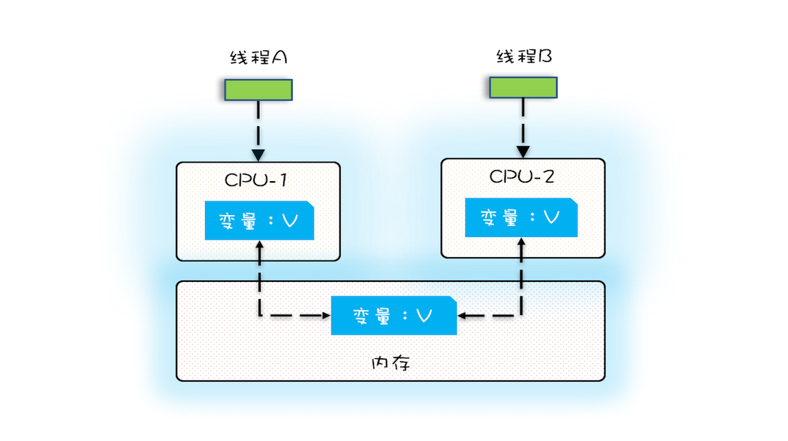
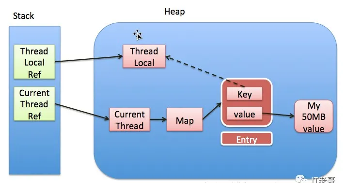
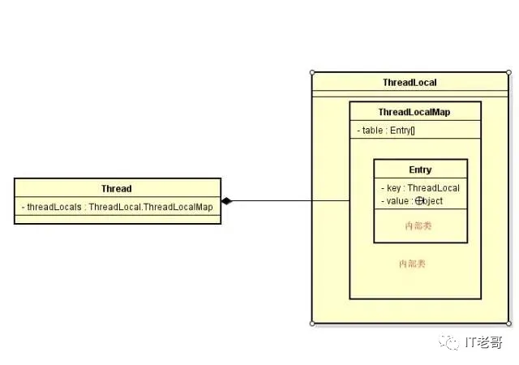

## 缓存使用原则

### 缓存数据分类

这些数据适合于使用缓存的方式访问

#### 1. 静态数据

一般不变，类似于字典表

#### 2. 准静态数据

变化频率很低，部门结构设置，全国行政区划数据等

#### 3. 中间状态数据

一些计算的可复用中间数据，变量副本，配置中心的本地副本。**此类数据可以随意丢弃，因为可以随时基于原始数据重新生成。**

### 缓存数据特征

- 热数据：使用频率高
- 「读写比」较大：读的频率 >> 写的频率

### 缓存实现方案

1. 可直接在代码中使用静态字段/常量实现
2. 可以使用配置中心实现：
   - 在应用启动时从配置中心加载并导入Spring的PropertySource，如系统配置「元proplus」
   - 延迟异步加载：使用独立线程，在应用运行过程中间隔特定的时间更新应用本地缓存，如（简单）业务配置「元confplus」
3. 使用分布式缓存技术实现：
   - Redis
   - Hazelcast/Ignite 内存网格

### 缓存其他概念

1. 广义上来说，为了加速数据处理，**让业务更快访问的临时存放的冗余数据**，都是缓存
2. 狭义上，现在我们一般在分布式系统里把缓存到内存的数据叫做内存缓存

缓存加载时机 

1. 启动全量加载 ==> 全局有效，使用简单 
2. 懒加载
   - 同步使用加载：先看缓存是否有数据，没有的话从数据库读取；读取的数据，先放到内存，然后返回给调用方
   - 延迟异步加载：从缓存获取数据，不管是否为空直接返回 ==> 
     - 策略1异步）如果为空，则发起一个异步加载的线程，负责加载数据
     - 策略2解耦）异步线程负责维护缓存的数据，定期或根据条件触发更新

### 缓存常见问题

#### 缓存穿透

问题：大量并发查询不存在的KEY，导致都直接将压力透传到数据库。 

分析：为什么会多次透传呢？不存在一直为空。 需要注意让缓存能够区分KEY不存在和查询到一个空值。 

解决办法： 

1. 缓存空值的KEY，这样第一次不存在也会被加载会记录，下次拿到有这个KEY。
2. Bloom过滤或RoaringBitmap 判断KEY是否存在。
3. 完全以缓存为准，使用 延迟异步加载 的策略2，这样就不会触发更新

#### 缓存击穿

问题：某个KEY失效的时候，正好有大量并发请求访问这个KEY。 

分析：跟前面一个其实很像，属于比较偶然的。 

解决办法：

1. KEY的更新操作添加全局互斥锁。
2. 完全以缓存为准，使用`延迟异步加载`的策略2，这样就不会触发更新

#### 缓存雪崩

问题：当某一时刻发生大规模的缓存失效的情况，会有大量的请求进来直接打到数据库，导致数 据库压力过大升值宕机。 

分析：一般来说，由于更新策略、或者数据热点、缓存服务宕机等原因，可能会导致缓存数据同 一个时间点大规模不可用，或者都更新。所以，需要我们的更新策略要在时间上合适，数据要均 匀分散，缓存服务器要多台高可用。 

解决办法：

1. 更新策略在时间上做到比较均匀。
2. 使用的热数据尽量分散到不同的机器上。
3. 多台机器做主从复制或者多副本，实现高可用。
4. 实现熔断限流机制，对系统进行负载能力控制

## 典型的缓存实现

### 1. 多核CPU并发程序的可见性问题

一个线程对共享变量的修改，另外一个线程能够立刻看到，我们称为可见性。

多核时代，每颗 CPU 都有自己的缓存，这时 CPU 缓存与内存的数据一致性就没那么容易解决了，当多个线程在不同的 CPU 上执行时，这些线程操作的是不同的 CPU 缓存。比如下图中，线程 A 操作的是 CPU-1 上的缓存，而线程 B 操作的是 CPU-2 上的缓存，很明显，这个时候线程 A 对变量 V 的操作对于线程 B 而言就不具备可见性了。这个就属于硬件程序员给软件程序员挖的“坑”。

## ThreadLocal - 八股文

1. 依赖关系：`Thread对象 -> ThreadLocal.ThreadLocalMap -> Entry[] -> Entry(WeakReference<ThreadLocal>, PayLoad)`
2. ThreadLocalMap：是个Map，内部结构/操作方法均重新实现：ThreadLocalMap实例引用Entry[]，采用开放寻址法，初始容量16，每次ReHash时容量加倍
3. Entry[]中，`Entry extends WeakReference<ThreadLocal<?>>`，其中key弱引用，value强引用。
4. ThreadLocal的作用：1）生成ThreadLocal对象作为Entry的Key；2）作为工具类，有很多操作方法

### 内存泄露

#### 依赖结构

1. 业务对象强引用ThreadLocal对象
2. Entry对象弱引用ThreadLocal对象「弱引用key」，强引用Value对象。

#### 问题分析

- 线程生命周期结束，Thread对象被回收

  由于 `线程 -> ThreadLocalMap -> Entry[] -> Entry(WeakReference<ThreadLocal>, PayLoad)`，所以所有无用的对象都会被回收。

- 业务对象移除ThreadLocal对象的依赖，线程仍然活跃
  - 由于`Entry(WeakReference<ThreadLocal>, PayLoad)`，Entry对象的key被回收，变为`null`。
  - 在以下场景中，Entry[] 中的 Entry 对象会被移除：
    - 调用方法：java.lang.ThreadLocal#set
    - 调用方法：java.lang.ThreadLocal#get
    - 调用方法：java.lang.ThreadLocal#remove

#### 实际依赖结构

#### JDK源码类的设计

#### ThreadLocal参考资料

- java.lang.ThreadLocal#set

1. 获取当前线程对象依赖的ThreadLocalMap对象。
2. 开放寻址法寻找空位置：找到空位置填入；若Entry对象的key为null，移除Entry对象后填入。
3. Entry[]搜索一遍后还无法插入：ReHash

- java.lang.ThreadLocal#get/remove

1. 获取当前线程对象依赖的ThreadLocalMap对象。
2. 开放寻址法寻找ThreadLocal对象：找到则返回value；若Entry对象的key为null，移除Entry对象，继续搜索。

## 参考资料

1. 极客时间：Java 并发编程实战