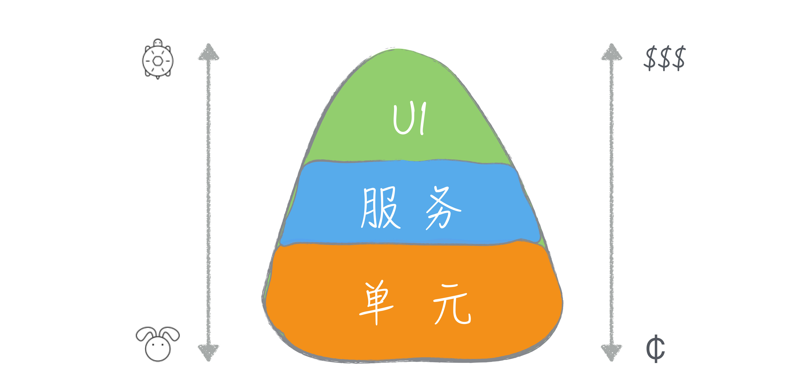

## 理论基础

### 为什么写测试？

关键原因：软件开发正在变得越来越复杂。测试可以让我们在越来越复杂的软件开发中能够稳步前行。

- 在编写新功能时，测试可以让我们的代码正确性得到验证，让我们拥有一个个稳定的模块。

- 测试可以帮助我们在长期的过程中不断回归，让每一步走得更稳。隔离变化，逐步编写稳定的代码。

### 为什么程序员要写测试？

程序员的测试 VS 测试人员的测试

**程序员的关注点是白盒测试，而测试人员则是黑盒测试。**

程序员的出发点是实现，而测试人员的出发点是业务。作为一个程序员，我们会把更多的时间放在关于技术实现的思考上，我们在发现问题上的训练强度是远远不够的。所以，人们常说，别用你的业余爱好去挑战别人吃饭的本事。

**程序员每多想到一点，软件质量就能多提高一点。**

测试人员并没有得到充分的发挥。只有程序员做好了自己的测试，测试人员才能从日常琐碎的验证工作中解脱出来，去做更有价值的测试。

### 单元测试最佳实践

**代码和测试一起写**

- **保证测试质量**：整个功能代码都写完了，再去写测试，你已经很难记得在编写这堆代码时所有的细节了，这个时候补写的测试对提升代码质量的帮助已经不是很大了。
- **工作的粒度要小**：把所有的功能写完的这个粒度实在是太大了。为一个大任务编写测试，是一件难度非常大的事，这也是很多人觉得测试难写的重要因素。
- **尽可能减少对于实现细节的约束**：mock时，倾向于使用宽泛一些的约束。这在某种程度上会降低未来重构代码时带来的影响。

### 保证自己编写的代码 100% 测试覆盖

1. **要有可测试的设计**，保证自己的代码完全可控
2. **测试和代码同步写**
3. **隔离难以测试的代码**：对于无法测试到第三方代码，要用一个薄薄的隔离层将代码隔离出去，在构建脚本中将隔离层排除在外。

### 集成测试

即便是 100% 的单元测试也不能解决所有的问题。有一个重要的原因在于，我们在编写每个单元时都会假设这些单元彼此之间能够很好地协同，但这个假设是不是一定成立呢？答案是不一定。除了要保证单元的正确，我们还要保证单元之间的协作也是正确的。**相对于单元测试只关注单元行为，集成测试关注的多个组件协同工作的表现。**

#### 集成测试的意义

- 是为了保证组件之间协作的正确性；
- 需要利用与产品代码相同的组件组装过程；
- 可以把已经测试好的稳定组件当做基础。

#### 两种集成问题及最佳实践

##### 1. 代码之间的集成

**1) 选择一条任务执行的路径，把路径上用到的组件集成到一起进行测试。**

单元测试完善后，意味着每个组件都已经经过了测试。所以，集成测试的重点就不再是组件之间两两协同进行测试了。

**2) 将框架集成进来，做一个完整的集成测试。**

尽可能地去集成，尽可能接近真实场景。如果我们能够把整个框架集成起来，这些东西也就可以验证了。

**3) 组件之间的集成逻辑，可不做单元测试 **

这部分代码实际上只是对业务逻辑做一个简单的封装，主要工作是信息的转发，这会是非常薄的一层。出于实用的考虑，在这里用集成测试代替单元测试，简化测试的编写。

##### 2. 代码与外部组件的集成

**1) 不能为了测试的需要而修改代码**

如果真的要修改，也许应该修改的是设计，而不仅仅是代码。业务代码中不能存在仅仅为了跑通一条测试用例而存在的特殊逻辑。

### 测试配比模型

#### 1. 冰淇淋蛋卷模型

冰淇淋蛋卷的出发点就是从单个测试的覆盖面考虑的，只要一些系统测试，就足以覆盖系统的大部分情况。当然，对于那些系统测试无法覆盖的场景就需要有低层的测试配合，比如，集成测试和单元测试。在冰淇淋蛋卷模型里，主力就是高层测试，低层测试只是作为高层测试的补充。

#### 2. 测试金字塔

#### 最佳实践

新项目：采用测试金字塔模型，一层一层地写测试。每完成一个功能，代码和测试总是同步写出来的，代码总是得到验证的，这样我们就可以稳步向前。

遗留项目：从系统测试入手，只要写上一些高层测试，就能够覆盖到系统的大部分功能，能够快速地建立起安全网，属于“投资少见效快”的做法。在有了一个安全网的底线之后，我们还是要向测试金字塔方向前进，以单元测试作为整体的基础。

### 写测试最佳实践

#### 1. 我们测试的目标是我们的代码，而不是外部依赖

由于其它程序库「JDK、二方库、三方库、RPC等」造成难以测试的问题，我们可以做一层层薄薄的封装，然后，在覆盖率检查中忽略它。封装和忽略，缺一不可。

#### 2. 编写可测试的代码

- 让自己的代码符合软件设计原则。

- 编写可组合的代码。
  - 不要在组件内部去创建对象，组件组装使用依赖注入。
  - 构造器注入 VS 字段注入

### 改造遗留系统的最佳实践

遗留系统就是那些没有测试的系统，给遗留系统写测试就是让一个系统恢复正常的过程。

1. 完整地给一个遗留系统写测试是比较困难的。一个实用的改进策略是，动到哪里，改哪里。

2. 改造遗留系统的关键是解耦。针对耦合严重的对象，提取方法，挪到一个封装类里面。**编写可组合的代码。**

## 单元测试、集成测试、系统测试对比

### 单元测试

描述：开发人员完成，对单元写测试，粒度尽可能小，一般是一个方法、一个类。

目标：保证每个零件都是稳定的。

用例数：最多

### 集成测试

描述：一般是开发人员完成，将多个单元集成在一起进行测试，一般测试完整的功能模块。一般集成Spring容器、内存数据库、已Mock的外部依赖等。

目标：保证功能模块是稳定的。不关注模块中的零件是否稳定「这是单元测试干的活」。

用例数：较少

### 系统测试

描述：测试人员完成，把整个系统完全集成起来，可以自动化执行。不关注实现细节，关注需求是否实现。

实践：对整个应用在 sit 环境进行测试，不对外部依赖做 Mock。

目标：保证完整的业务是稳定的。理论上无需过多关注细节「单元测试、集成测试理论上做了这些，但是实际上系统测试还是要关注细节」

用例数：较少

## 参考资料

1. 极客时间 - 专栏 - 程序员的测试课