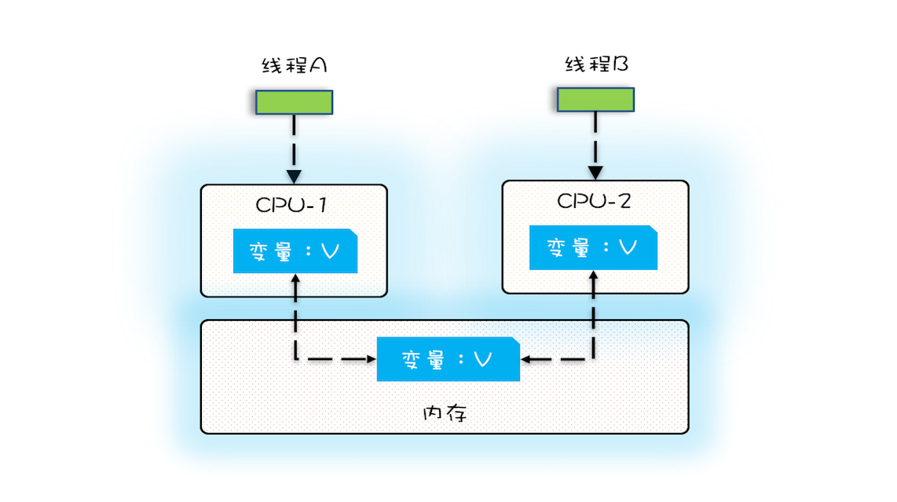

## 缓存使用原则

### 缓存数据分类

这些数据适合于使用缓存的方式访问

#### 1. 静态数据

一般不变，类似于字典表

#### 2. 准静态数据

变化频率很低，部门结构设置，全国行政区划数据等

#### 3. 中间状态数据

一些计算的可复用中间数据，变量副本，配置中心的本地副本。**此类数据可以随意丢弃，因为可以随时基于原始数据重新生成。**

### 缓存数据特征

- 热数据：使用频率高
- 「读写比」较大：读的频率 >> 写的频率

### 缓存实现方案

1. 可直接在代码中使用静态字段/常量实现
2. 可以使用配置中心实现：
   - 在应用启动时从配置中心加载并导入Spring的PropertySource，如系统配置「元proplus」
   - 延迟异步加载：使用独立线程，在应用运行过程中间隔特定的时间更新应用本地缓存，如（简单）业务配置「元confplus」
3. 使用分布式缓存技术实现：
   - Redis
   - Hazelcast/Ignite 内存网格

### 缓存其他概念

1. 广义上来说，为了加速数据处理，**让业务更快访问的临时存放的冗余数据**，都是缓存

2. 狭义上，现在我们一般在分布式系统里把缓存到内存的数据叫做内存缓存

## 典型的缓存实现

### 1. 多核CPU并发程序的可见性问题

一个线程对共享变量的修改，另外一个线程能够立刻看到，我们称为可见性。

多核时代，每颗 CPU 都有自己的缓存，这时 CPU 缓存与内存的数据一致性就没那么容易解决了，当多个线程在不同的 CPU 上执行时，这些线程操作的是不同的 CPU 缓存。比如下图中，线程 A 操作的是 CPU-1 上的缓存，而线程 B 操作的是 CPU-2 上的缓存，很明显，这个时候线程 A 对变量 V 的操作对于线程 B 而言就不具备可见性了。这个就属于硬件程序员给软件程序员挖的“坑”。

参考资料

1. 极客时间：Java 并发编程实战